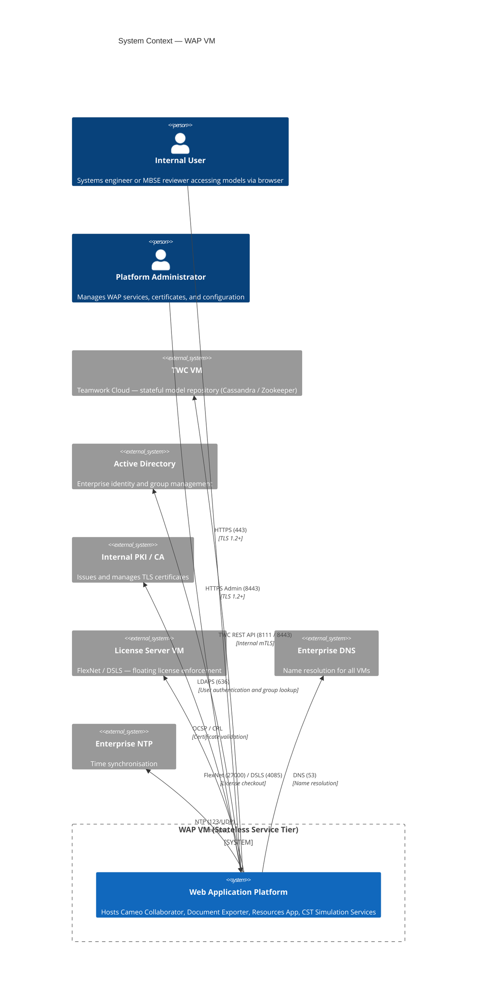
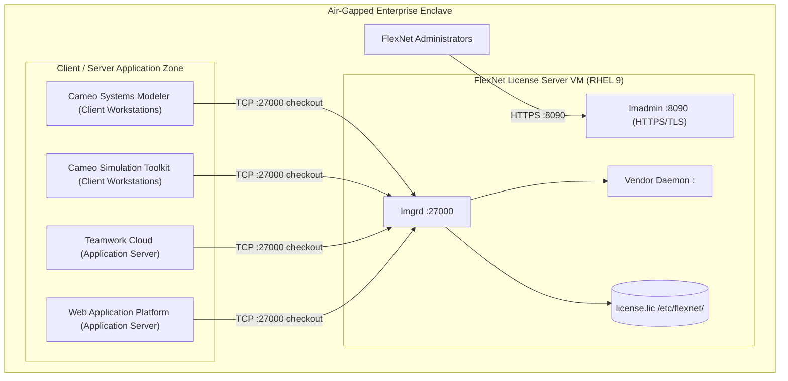
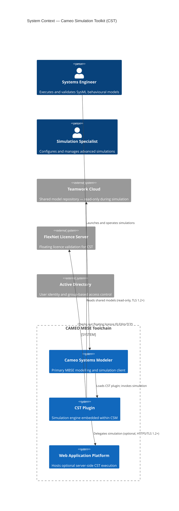
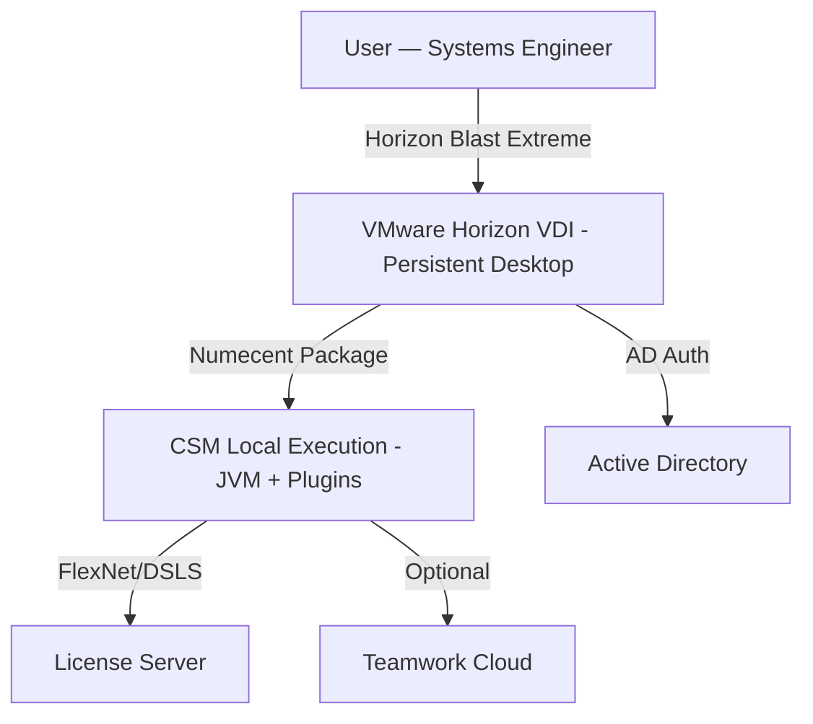

# Phoenix CAMEO — Master Architecture Overview

> **Programme:** Phoenix CAMEO MBSE  
> **Document Type:** Architecture Overview  
> **Generated:** 2026-04-08  
> **Components Covered:** WAP · TWC · FlexNet · CST · CSM

---

## Contents

- [WAP — Web Application Platform (WAP)](#wap--web-application-platform-wap)
- [TWC — Teamwork Cloud (TWC)](#twc--teamwork-cloud-twc)
- [FLEXNET — FlexNet License Server](#flexnet--flexnet-license-server)
- [CST — Cameo Simulation Toolkit (CST)](#cst--cameo-simulation-toolkit-cst)
- [CSM — Cameo Systems Modeler (CSM)](#csm--cameo-systems-modeler-csm)

---

## WAP — Web Application Platform (WAP)

> **Source:** `wap/docs/01_architecture_overview.md`  
> **Status:** Draft 0.2 | **Doc Ref:** WAP-DOC-01

# WAP-DOC-01 — Architecture Overview
## Web Application Platform VM

---

### 1. Purpose

This document provides a high-level architectural overview of the Web Application Platform (WAP) VM within the CAMEO enterprise deployment. The WAP delivers all web-facing and service-oriented capabilities of the Dassault Systèmes / No Magic CAMEO toolchain. It is architecturally isolated from the stateful Teamwork Cloud repository tier, enabling independent scaling, JVM tuning, and rolling upgrades without risk to model data integrity.

---

### 2. Scope

**In Scope — Hosted on This VM**

| Component | Role |
|---|---|
| Web Application Platform (WAP) | Platform runtime hosting all web services |
| Cameo Collaborator | Browser-based MBSE model review and collaboration |
| Resources Application | Shared resource serving (icons, libraries, attachments) |
| Document Exporter | Server-side document generation from MBSE models |
| CST Simulation Services | Server-side SysML simulation execution |

**Out of Scope — NOT Hosted Here**

| Component | Rationale |
|---|---|
| Teamwork Cloud | Stateful I/O-intensive — hosted on dedicated TWC VM |
| Apache Cassandra | TWC persistence layer — co-located with TWC |
| Zookeeper | TWC cluster coordination — co-located with TWC |
| License Server (FlexNet / DSLS) | Mission-critical shared service — dedicated License VM |

---

### 3. System Context



---

### 4. Non-Functional Characteristics

| Characteristic | Requirement |
|---|---|
| Statefulness | Stateless — no persistent data stored locally on restart |
| CPU profile | CPU-intensive (JVM + simulation); tuned GC and heap required |
| TLS | All user and admin endpoints are TLS 1.2+ only |
| Data at rest | No model data stored locally; configuration files only |
| Scalability | Horizontal scaling supported behind load balancer |

### 5. Security Posture Summary

| Control Area | Approach |
|---|---|
| Authentication | Active Directory via LDAPS — no local accounts |
| Authorisation | Role-based access control (see WAP-DOC-08) |
| Transport security | TLS 1.2+ with FIPS 140-3 approved cipher suites |
| Host hardening | DISA STIG + CIS Benchmark Level 2 applied at OS layer |
| Crypto | FIPS 140-3 compliant JVM and TLS modules |
| Audit logging | All admin and user actions logged centrally |

---

## TWC — Teamwork Cloud (TWC)

> **Source:** `twc/docs/01_architecture_overview.md`  
> **Status:** Not Started 0.1-DRAFT | **Doc Ref:** DOC-01

# DOC-01 — Architecture Overview
## Teamwork Cloud Core Repository VM

---

### 1. Purpose

_Describe the high-level architectural intent of the Teamwork Cloud Core Repository VM deployment._

### 2. Key Components

| Component | Role | Notes |
|-----------|------|-------|
| Teamwork Cloud | Core persistence & collaboration | |
| Apache Cassandra | Distributed data store | |
| Zookeeper | Cluster coordination | |

### 3. System Context

```mermaid
C4Context
    title System Context — TWC Core Repository VM
    %% TODO: populate after architecture elaboration
```

### 4. Quality Attributes

| Attribute | Target |
|-----------|--------|
| Availability | ≥ 99.9% |
| Storage latency | < 20 ms (intra-DC) |
| Data durability | No loss on JVM restart |

---

## FLEXNET — FlexNet License Server

> **Source:** `flexnet/docs/01_license_architecture_overview.md`  
> **Status:** ✅ Complete | **Version:** 0.2.0

# 01 — License Architecture Overview

**Classification:** OFFICIAL — SENSITIVE

---

### 1. Purpose

The license server is **mission-critical**: all Dassault Systèmes tooling (Cameo Systems Modeler, Cameo Simulation Toolkit, Teamwork Cloud, and Web Application Platform) requires a valid floating licence checkout before any session can be established. An unplanned outage causes **complete tool unavailability** across all users simultaneously.

---

### 2. System Context



---

### 3. Components

| Component | Role | Port |
|-----------|------|------|
| lmgrd | License Manager Daemon — accepts checkout requests | TCP 27000 |
| lmadmin | Web Administration Interface | HTTPS 8090 |
| Vendor Daemon | Dassault Systèmes-supplied binary, product-specific licence policy | TCP `<VENDOR_DAEMON_PORT>` |
| Licence File (.lic) | Server-bound licence file tied to host MAC address | — |

---

### 4. Served Products

| Product | Short | FlexNet Feature Name | Licence Type |
|---------|-------|---------------------|--------------|
| Cameo Systems Modeler | CSM | `<CSM_FEATURE_NAME>` | Floating |
| Cameo Simulation Toolkit | CST | `<CST_FEATURE_NAME>` | Floating |
| Teamwork Cloud | TWC | `<TWC_FEATURE_NAME>` | Floating |
| Web Application Platform | WAP | `<WAP_FEATURE_NAME>` | Floating |

---

### 5. High Availability and Recovery

| Mechanism | Description |
|-----------|-------------|
| Hypervisor snapshots | Weekly automated + pre/post every change |
| Service auto-restart | `systemd` `Restart=on-failure` with back-off |
| Licence file backup | Stored separately from VM; restorable independently |
| Documented runbook | Full step-by-step in `docs/05_license_recovery_failover_runbook.md` |

**No hot standby.** Recovery is snapshot-based with documented RTO of **4 hours** (draft — requires ISSO/AO approval).

---

### Sources

- PRD_3_License_Server_VM.md (programme artefact)
- FlexNet Publisher documentation — Revenera (https://docs.revenera.com)
- NIST SP 800-53 Rev 5 (https://csrc.nist.gov/publications/detail/sp/800-53/rev-5/final)
- JSP 939 — Defence Policy for Modelling and Simulation (MOD, 2023)

---

## CST — Cameo Simulation Toolkit (CST)

> **Source:** `cst/docs/01_simulation_architecture_overview.md`  
> **Status:** In Progress 0.2-DRAFT | **Doc Ref:** DOC-01

# DOC-01 — Simulation Architecture Overview
## Cameo Simulation Toolkit (CST)

---

### 1. Purpose

CST enables Systems Engineers to execute, validate, and analyse SysML behavioural models — including state machines, activity diagrams, parametric models, and executable constraint blocks — directly within Cameo Systems Modeler (CSM) or delegated to a remote execution service.

---

### 2. Execution Modes

| Mode | Platform | Trigger | Licence Checkout |
|------|----------|---------|-----------------|
| **Local (client-side)** | Windows 10/11 | User launches simulation within CSM | Client floating checkout |
| **Server-side** | Windows Server 2025 (via WAP) | User delegates from CSM client | Server-side floating checkout pool |

---

### 3. System Context



---

### 4. Quality Attributes

| Attribute | Target |
|-----------|--------|
| **Execution determinism** | 100% reproducible results across identical inputs |
| **JVM stability** | No simulation-induced CSM crash or memory fault |
| **Availability (server mode)** | ≥ 99.5% during core operational hours |
| **Least privilege** | All execution constrained to the invoking user's AD privileges |
| **Auditability** | All simulation launches and results logged to Windows Event Log |

---

### 5. Open Issues

| ID | Description | Impact | Owner |
|----|-------------|--------|-------|
| GAP-01 | JVM version not confirmed by vendor | Sizing and compliance | TA |
| GAP-02 | CST product version not confirmed | Compliance mapping | TA |
| GAP-03 | WAP integration API contract not documented | Integration | PO |
| GAP-04 | FlexNet licence pool size for server-side checkout not defined | Capacity | TA |

---

## CSM — Cameo Systems Modeler (CSM)

> **Source:** `csm/docs/01_architecture_overview.md`  
> **Status:** ✅ Done

# 01 — Client Architecture Overview (VDI + Numecent)

---

### 1. Purpose

The Phoenix Programme deploys Cameo Systems Modeler (CSM) as the primary desktop authoring tool for SysML modelling, requirements traceability, and system analysis. The approved delivery model is:

- **Numecent Application Virtualization** — packages CSM as an immutable, signed, version-controlled virtual application.
- **VMware Horizon Persistent VDI** — provides a dedicated, hardened Windows desktop in which CSM executes locally.

---

### 2. Deployment Model



---

### 3. Component Summary

| Component | Role | Location |
|---|---|---|
| VMware Horizon Connection Server | Broker — routes users to VDI desktops | Infrastructure |
| VMware Horizon VDI Desktop (Persistent) | User's dedicated compute environment | VDI segment |
| Numecent Cloudpaging Server | Hosts and streams CSM application package | Infrastructure |
| CSM Application (Numecent Package) | SysML authoring — executes locally in VDI | Within VDI OS |
| Embedded JVM | Java runtime — vendor-packaged inside CSM package | Within VDI OS |
| FlexNet / DSLS Licence Server | Issues and tracks floating licences | Infrastructure |
| Teamwork Cloud (TWC) | Central MBSE model repository (optional) | TWC segment |
| Active Directory | Identity and authentication authority | Identity zone |

---

### 4. Key Design Decisions

| Decision | Rationale |
|---|---|
| Persistent VDI (not non-persistent) | JVM cache behaviour and plugin persistence require a stable, dedicated desktop |
| Numecent over SCCM | Immutable versioned packages, rapid rollback, delta streaming |
| Local VDI execution (not RDS) | GUI latency-sensitive; dedicated CPU/RAM; vendor-supported |
| Vendor-embedded JVM | Validated, tested JVM version; avoids version drift |
| No internet access | Defence enclave policy; all connectivity via explicit allow-list |
| AD-only authentication | No embedded credentials; all identity flows through Kerberos/AD |

---

*Generated: 2026-04-08 | Classification: OFFICIAL — SENSITIVE | Author: Iain Reid*
