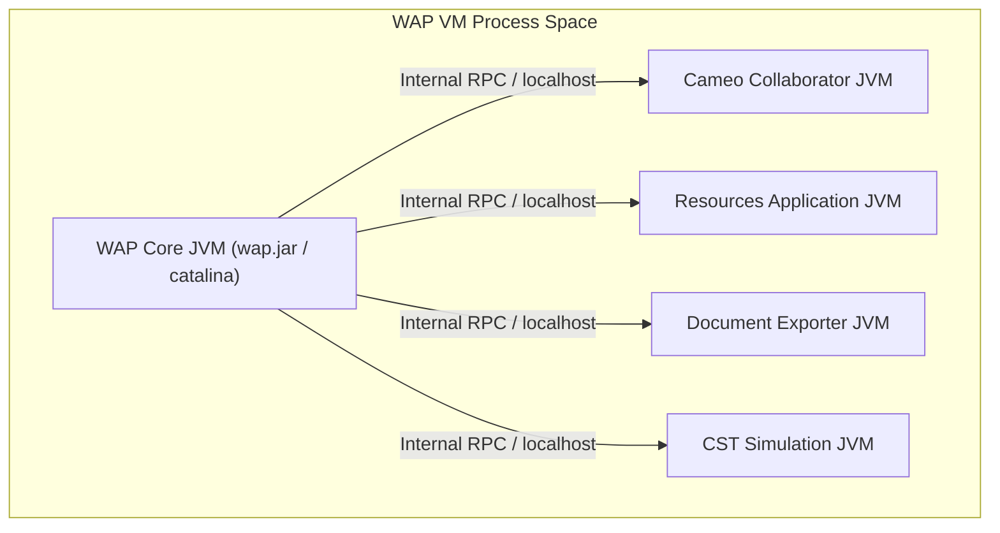
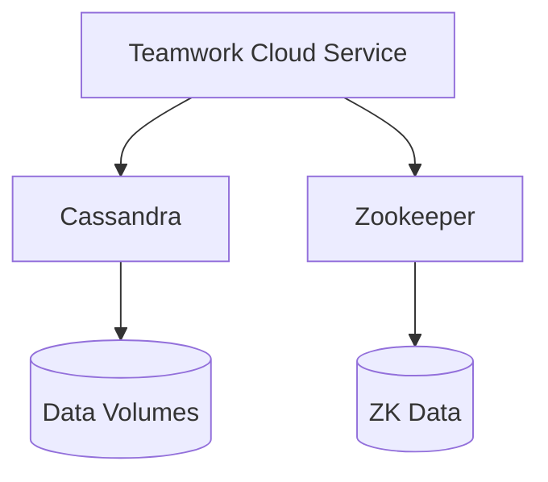
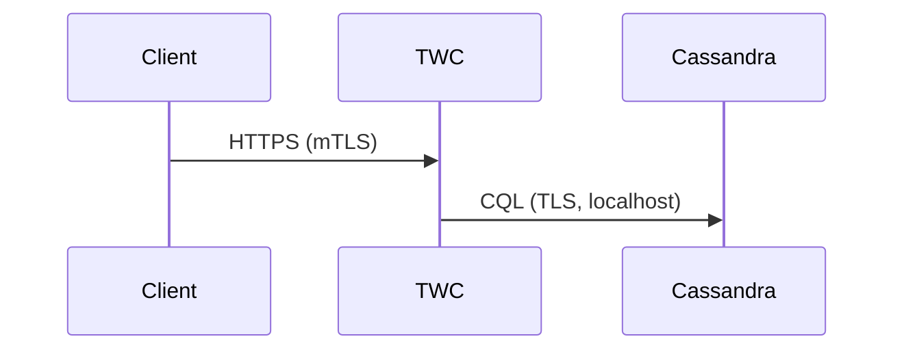
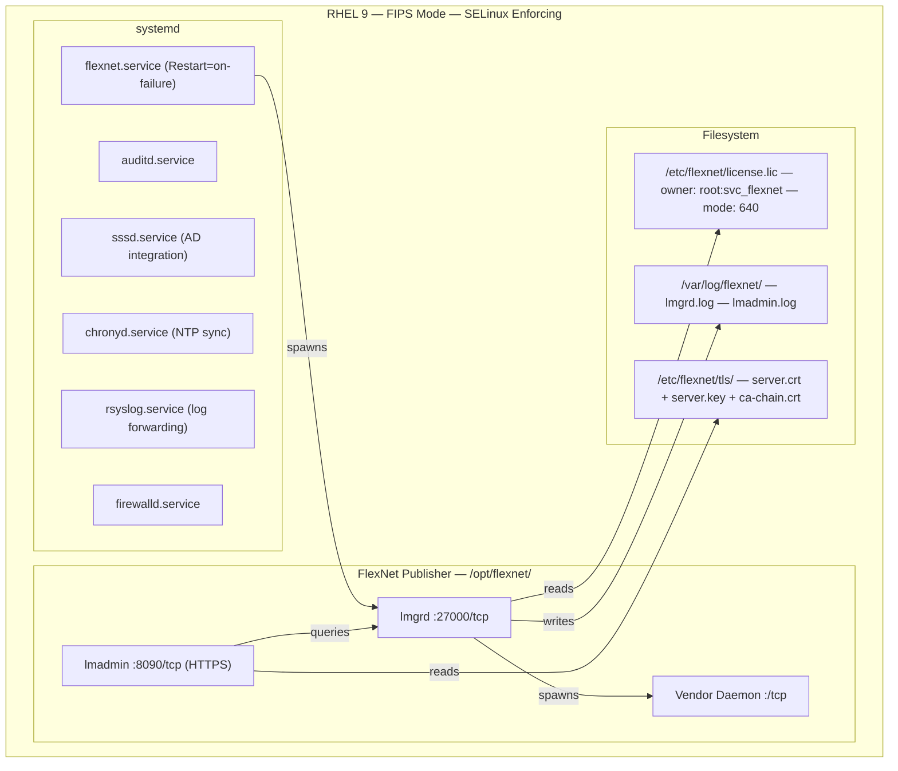
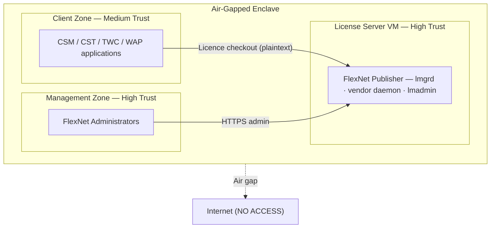
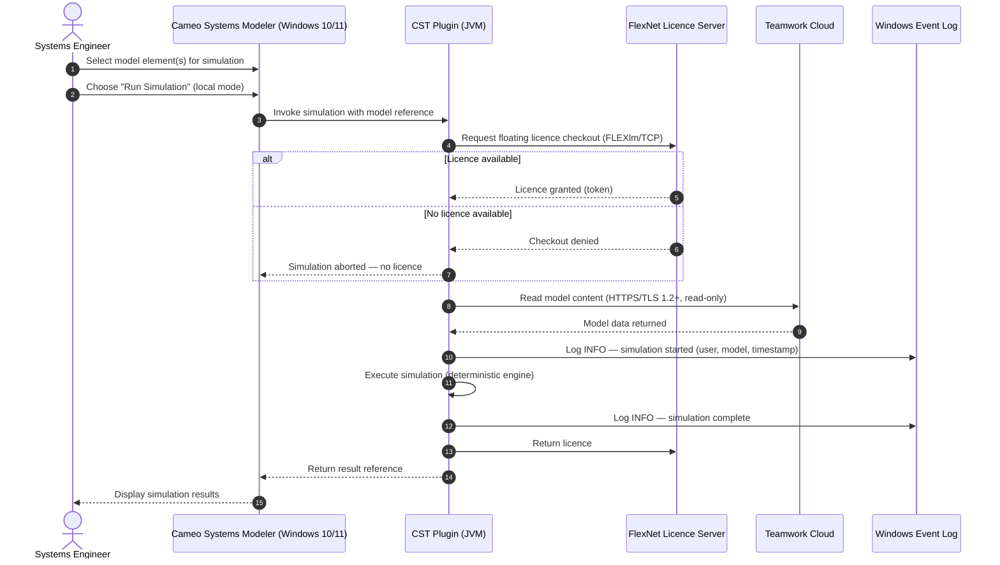
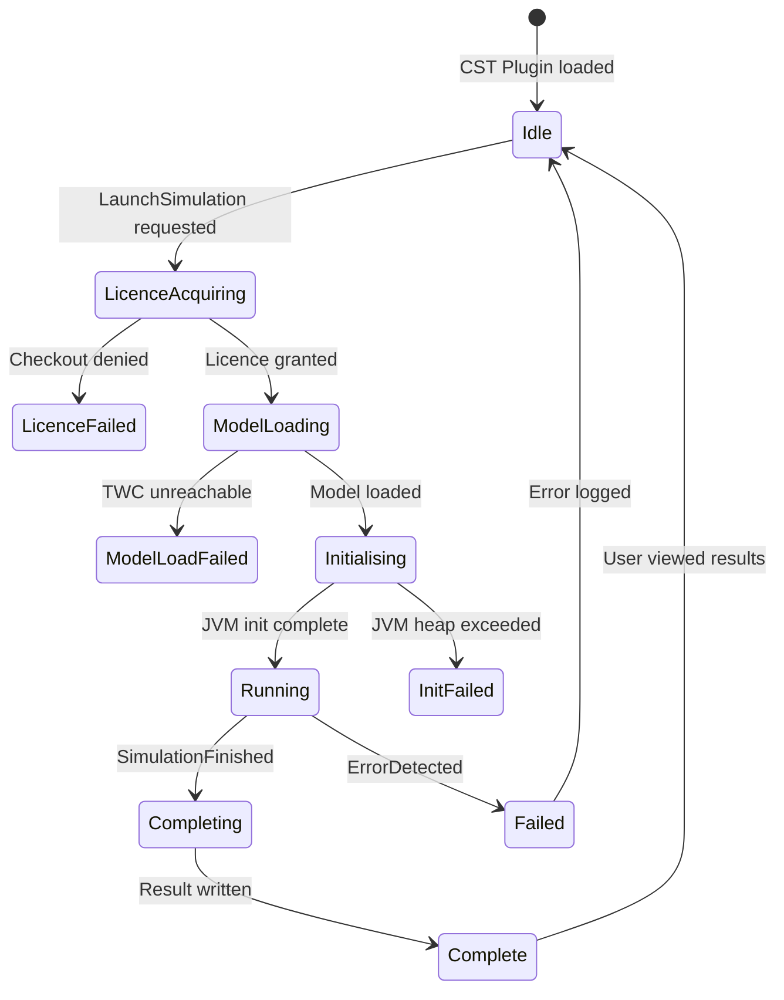
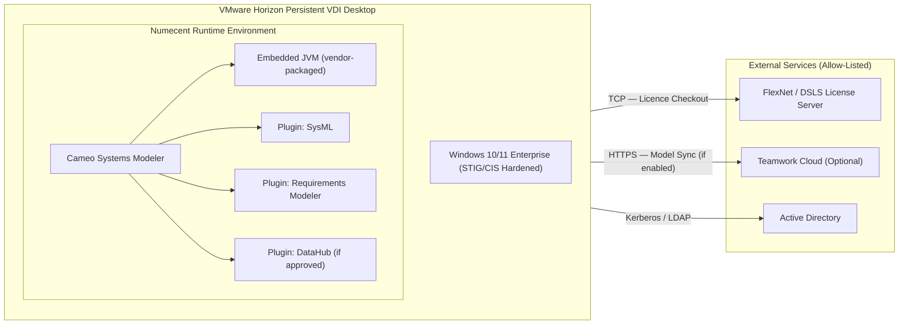

# Phoenix CAMEO — Master Inside-Out Detailed Architecture

> **Programme:** Phoenix CAMEO MBSE  
> **Document Type:** Detailed Architecture  
> **Generated:** 2026-04-08  
> **Components Covered:** WAP · TWC · FlexNet · CST · CSM

---

## Contents

- [WAP — Web Application Platform (WAP)](#wap--web-application-platform-wap)
- [TWC — Teamwork Cloud (TWC)](#twc--teamwork-cloud-twc)
- [FLEXNET — FlexNet License Server](#flexnet--flexnet-license-server)
- [CST — Cameo Simulation Toolkit (CST)](#cst--cameo-simulation-toolkit-cst)
- [CSM — Cameo Systems Modeler (CSM)](#csm--cameo-systems-modeler-csm)

---

## WAP — Web Application Platform (WAP)

> **Source:** `wap/docs/02_inside_out_architecture.md`  
> **Status:** Draft 0.2 | **Doc Ref:** WAP-DOC-02

# WAP-DOC-02 — Inside-Out Detailed Architecture

---

### 1. JVM Process Architecture

Each WAP component runs in its own JVM process. The WAP runtime process acts as the coordinator, with subordinate services registering with it on startup.



### JVM Configuration Summary

| Process | Recommended Heap (Xmx) | GC Policy | Run-as Account |
|---|---|---|---|
| WAP Core | 4–8 GB | G1GC | `wap` (non-root service account) |
| Cameo Collaborator | 2–4 GB | G1GC | `wap` |
| Resources Application | 512 MB–1 GB | G1GC | `wap` |
| Document Exporter | 2–4 GB | G1GC | `wap` |
| CST Simulation | 4–8 GB (per worker) | G1GC | `wap` |

---

### 2. Network Ports and Protocols

| Port | Protocol | Service | TLS | Direction | Source / Destination |
|---|---|---|---|---|---|
| 443 | HTTPS | WAP / Collaborator (user-facing) | Yes — TLS 1.2+ | Inbound | Internal user network |
| 8443 | HTTPS | WAP Admin console | Yes — TLS 1.2+ | Inbound | Admin management VLAN |
| 8111 | HTTPS | WAP → TWC REST API | Yes — mTLS | Outbound | TWC VM |
| 636 | LDAPS | WAP → Active Directory | Yes — LDAPS | Outbound | Active Directory |
| 27000 | TCP | License checkout (FlexNet) | No (or vendor TLS) | Outbound | License Server VM |
| 4085 | TCP | License checkout (DSLS) | Vendor TLS | Outbound | License Server VM |
| 123 | UDP | NTP | N/A | Outbound | Enterprise NTP |
| 53 | UDP/TCP | DNS | N/A | Outbound | Enterprise DNS |

---

### 3. Filesystem Layout

```
/opt/
└── nomagic/
    ├── wap/
    │   ├── bin/              ← start/stop scripts
    │   ├── conf/             ← core configuration files
    │   │   ├── application.properties
    │   │   ├── twc.properties
    │   │   ├── ldap.properties
    │   │   └── ssl/          ← TLS keystore and truststore
    │   ├── lib/              ← WAP JARs and dependencies
    │   └── webapps/          ← deployed web applications
    ├── collaborator/
    ├── resources/
    ├── doc-exporter/
    ├── cst/
    └── logs/

/var/
└── nomagic/
    └── wap/
        └── tmp/              ← Ephemeral scratch — cleared on restart
```

**Key principle:** No model data, no session data, and no user-uploaded content is stored under `/opt/nomagic`. All persistent state lives in Teamwork Cloud (TWC VM). The `/var/nomagic/wap/tmp/` directory is ephemeral and cleared on restart — this enforces stateless behaviour.

---

### 4. Key Configuration Files

| File | Location | Purpose |
|---|---|---|
| `application.properties` | `/opt/nomagic/wap/conf/` | Core WAP runtime settings |
| `twc.properties` | `/opt/nomagic/wap/conf/` | TWC REST API endpoint, credentials |
| `ldap.properties` | `/opt/nomagic/wap/conf/` | Active Directory LDAP/LDAPS bind and search base |
| `ssl/keystore.p12` | `/opt/nomagic/wap/conf/ssl/` | WAP TLS server certificate and private key (PKCS#12) |
| `ssl/truststore.jks` | `/opt/nomagic/wap/conf/ssl/` | Trusted CA chain including internal PKI root |

**Security requirement:** Configuration files must be owned by `wap:wap`, mode `0640`. The `ssl/` directory must be `0700`.

---

## TWC — Teamwork Cloud (TWC)

> **Source:** `twc/docs/02_inside_out_architecture.md`  
> **Status:** Not Started 0.1-DRAFT | **Doc Ref:** DOC-02

# DOC-02 — Inside-Out Detailed Architecture
## Teamwork Cloud Core Repository VM

---

### 1. Process Architecture



### 2. Service Port Map

| Service | Port | Protocol | Direction | Notes |
|---------|------|----------|-----------|-------|
| TWC API | 8111 | HTTPS/TLS | Inbound | mTLS enforced |
| Cassandra | 9042 | CQL/TLS | Internal | Localhost only |
| Zookeeper | 2181 | TCP | Internal | Localhost only |

### 3. Network Flows



> ⚠️ **Status:** This document is Not Started. Sections require completion after architecture elaboration.

---

## FLEXNET — FlexNet License Server

> **Source:** `flexnet/docs/02_inside_out_architecture.md`  
> **Status:** ✅ Complete | **Version:** 0.2.0

# 02 — Inside-Out Architecture Diagram

---

### 1. Inside View — What Lives on the VM



---

### 2. Data Flows

| Flow | Direction | Protocol | Port | Purpose | Encrypted |
|------|-----------|----------|------|---------|-----------|
| Licence checkout | Client → VM | TCP | 27000 | Client contacts lmgrd | No (FlexNet wire protocol) |
| Checkout redirect | Client → VM | TCP | `<VENDOR_PORT>` | Client contacts vendor daemon | No (FlexNet wire protocol) |
| Admin console | Admin → VM | HTTPS | 8090 | lmadmin web UI | Yes — TLS 1.2+ |
| AD authentication | VM → AD | LDAPS | 636 | Bind for SSSD / lmadmin | Yes — TLS |
| Audit log forwarding | VM → SIEM | Syslog | 514 | Log shipping | TLS if SIEM supports it |
| NTP sync | VM → NTP | NTP | 123 | Clock accuracy for audit | No (NTP) |

> **Security note:** The FlexNet checkout wire protocol (TCP 27000) is not natively encrypted. Network-layer controls (firewall allow-lists restricting source subnet) compensate. This is recorded in `docs/06_security_analysis.md` GAP-005.

---

### 3. Trust Boundaries



---

### Sources

- PRD_3_License_Server_VM.md (programme artefact)
- Revenera FlexNet Publisher Administration Guide (https://docs.revenera.com)
- NIST SP 800-53 Rev 5 SC-8
- JSP 939 — Defence Policy for Modelling and Simulation (MOD, 2023)

---

## CST — Cameo Simulation Toolkit (CST)

> **Source:** `cst/docs/02_execution_flow_diagrams.md`  
> **Status:** In Progress 0.2-DRAFT | **Doc Ref:** DOC-02

# DOC-02 — Execution Flow Diagrams
## Cameo Simulation Toolkit (CST)

---

### 1. Flow 1 — Local Simulation Execution



---

### 2. State Machine — Simulation Lifecycle



---

### 3. Flow 2 — Server-Side Simulation Execution (via WAP)

```mermaid
sequenceDiagram
    autonumber
    actor SE as Systems Engineer
    participant CSM as CSM Client (Windows 10/11)
    participant WAP as Web Application Platform (Windows Server 2025)
    participant CST_S as CST Server Service (JVM)
    participant LIC as FlexNet Licence Server
    participant AD as Active Directory

    SE->>CSM: Select model; choose "Run Simulation (server-side)"
    CSM->>WAP: HTTPS POST /simulate (TLS 1.2+, Kerberos token)
    WAP->>AD: Validate Kerberos token; check group membership
    alt Auth fails or insufficient role
        AD-->>WAP: Denied
        WAP-->>CSM: 403 Forbidden
    end
    AD-->>WAP: Auth OK; roles confirmed
    WAP->>CST_S: Route simulation request
    CST_S->>LIC: Request server-side licence checkout
    LIC-->>CST_S: Licence granted
    CST_S->>CST_S: Execute simulation
    CST_S->>LIC: Return licence
    CST_S-->>WAP: Return result reference
    WAP-->>CSM: HTTPS 200 + result reference
    CSM-->>SE: Display simulation results
```

---

## CSM — Cameo Systems Modeler (CSM)

> **Source:** `csm/docs/02_logical_component_diagram.md`  
> **Status:** ✅ Done

# 02 — Logical Component Diagram

---

### 1. Component Diagram



---

### 2. Data Flows

| Flow | Source | Destination | Protocol | Port | Notes |
|---|---|---|---|---|---|
| Licence checkout/return | VDI | FlexNet Licence Server | TCP | 27000 | Confirm with Infrastructure |
| Application package streaming | VDI | Numecent Cloudpaging Server | HTTPS | 443 | Initial and delta package block delivery |
| Model sync | VDI | TWC | HTTPS | 443 | Optional — only if TWC enabled; FIPS TLS |
| Authentication | VDI | Active Directory DC | Kerberos | 88 | Primary auth |
| LDAP directory query | VDI | Active Directory DC | LDAP/LDAPS | 389 / 636 | Group membership queries |

---

### 3. Component Descriptions

| Component | Description | Owner |
|---|---|---|
| VMware Horizon VDI | Persistent dedicated desktop session; single-user assigned | VDI Platform |
| Numecent Runtime | Application virtualisation layer; streams and executes CSM package | MBSE Tool Admin |
| Cameo Systems Modeler | SysML authoring application — primary user-facing tool | MBSE Tool Admin |
| Embedded JVM | Vendor-packaged Java runtime inside the CSM Numecent package | MBSE Tool Admin |
| SysML Plugin | Core SysML 1.x/2.x diagram support; bundled in package | MBSE Tool Admin |
| Requirements Modeler Plugin | Requirements capture and traceability | MBSE Tool Admin |
| FlexNet / DSLS Licence Server | Floating licence management for CSM seats | Infrastructure |
| Teamwork Cloud | Central MBSE model repository — optional | TWC Admin |
| Active Directory | Identity, authentication, and group-based access control | AD / IAM |

---

*Generated: 2026-04-08 | Classification: OFFICIAL — SENSITIVE | Author: Iain Reid*
