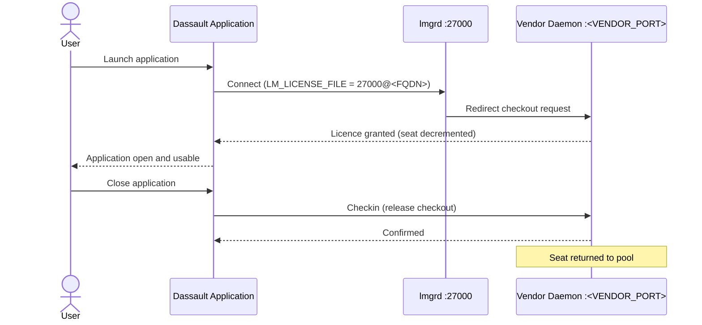

# Phoenix CAMEO — Master User Guide

> **Programme:** Phoenix CAMEO MBSE  
> **Document Type:** User Guide  
> **Generated:** 2026-04-08  
> **Components Covered:** WAP · TWC · FlexNet · CST · CSM

---

## Contents

- [WAP — Web Application Platform (WAP)](#wap--web-application-platform-wap)
- [TWC — Teamwork Cloud (TWC)](#twc--teamwork-cloud-twc)
- [FLEXNET — FlexNet License Server (User License Consumption)](#flexnet--flexnet-license-server)
- [CST — Cameo Simulation Toolkit (CST)](#cst--cameo-simulation-toolkit-cst)
- [CSM — Cameo Systems Modeler (CSM)](#csm--cameo-systems-modeler-csm)

---

## WAP — Web Application Platform (WAP)

> **Source:** `wap/docs/03_user_guide.md` | **Status:** Draft 0.2 | **Doc Ref:** WAP-DOC-03

# WAP-DOC-03 — User Guide

**Audience:** Internal users — systems engineers, MBSE practitioners, project reviewers

---

### 1. Accessing the Platform

| Item | Detail |
|---|---|
| URL | `https://<wap-hostname>/` (confirm with your administrator) |
| Protocol | HTTPS only — HTTP connections are not accepted |
| Authentication | Your organisational (Active Directory) username and password |
| Session timeout | Session expires after a period of inactivity |

---

### 2. Cameo Collaborator

Cameo Collaborator allows you to browse, review, and annotate MBSE models stored in Teamwork Cloud — without needing Cameo Systems Modeler installed.

**Browsing:** After logging in, select **Collaborator** from the WAP home screen. Select a project you have permission to access and navigate packages, elements, and diagrams using the left-hand navigation panel.

**Viewing Diagrams:** Click a diagram name to open it. Diagrams render as interactive SVG. Click on a model element to view its properties in the right-hand panel.

**Commenting:** With a diagram open, click **Add Comment** in the right-hand panel. Comments are visible to all users with project access. Requires the Collaborator User role.

---

### 3. Document Exporter

1. From the WAP home screen, select **Document Export**.
2. Select the project and model area you wish to export.
3. Select a document template from the list.
4. Select the output format: **PDF** or **DOCX**.
5. Click **Export**. The job will queue — download the result when complete.

> **Note:** Exported documents are ephemeral — they are not stored permanently on the WAP. Download your document promptly.

---

### 4. Access Levels

| Role | What You Can Do |
|---|---|
| Collaborator Viewer | Browse models and view diagrams — read only |
| Collaborator User | Browse, view, comment, and annotate models |
| Document Export User | All Viewer access + submit document export jobs |
| Simulation User | All Viewer access + submit and monitor simulation jobs |

---

### 5. Getting Help

| Contact | When to Use |
|---|---|
| DXC Service Desk | Login issues, access requests, general faults |
| Platform Administrator | Configuration issues, performance concerns, certificate errors |

---

## TWC — Teamwork Cloud (TWC)

> **Source:** `twc/docs/03_user_guide.md` | **Status:** Not Started 0.1-DRAFT | **Doc Ref:** DOC-03

# DOC-03 — User Guide
## Teamwork Cloud Core Repository VM

**Audience:** Systems Engineers, Enterprise & Solution Architects

---

### 1. Prerequisites

- Cameo Systems Modeler (or equivalent) installed
- Valid AD account with TWC role assignment
- Network access to TWC server on port 8111 (HTTPS)
- Enterprise CA root certificate trusted on workstation

---

### 2. Connecting to Teamwork Cloud

_Step-by-step instructions for opening a server connection from Cameo are to be completed._

---

### 3. Working with Projects

| Task | Steps |
|------|-------|
| Check out a project | _TBD_ |
| Commit changes | _TBD_ |
| View project history | _TBD_ |

---

### 4. Troubleshooting

| Symptom | Likely Cause | Resolution |
|---------|-------------|------------|
| Cannot connect | TLS cert not trusted | Import enterprise CA root |
| Login rejected | AD account not in TWC group | Contact administrator |

> ⚠️ **Status:** This document is Not Started. Content requires completion.

---

## FLEXNET — FlexNet License Server

> **Source:** `flexnet/docs/04_user_license_consumption_guide.md` | **Status:** ✅ Complete | **Version:** 0.2.0

# 04 — User License Consumption Guide

**Audience:** End users of Cameo Systems Modeler (CSM), Cameo Simulation Toolkit (CST), Teamwork Cloud (TWC), and Web Application Platform (WAP)

---

### 1. How Floating Licences Work

A **floating licence** is not tied to a single machine. It is held in a shared pool on the license server. When you launch a Dassault tool:

1. The application contacts the FlexNet license server at `<FLEXNET_FQDN>` on TCP port 27000.
2. The server checks whether a licence seat is available in the pool.
3. If a seat is available, it is **checked out** to your session.
4. The licence is held for as long as the application is open.
5. When you close the application, the licence is **checked in** automatically.



---

### 2. Configuring Your Client

| Product | Configuration Method |
|---------|---------------------|
| Cameo Systems Modeler | Help → License Manager → Server address field |
| Cameo Simulation Toolkit | Help → License Manager → Server address field |
| Teamwork Cloud | TWC server configuration — set by administrator at install time |
| Web Application Platform | WAP server configuration — set by administrator at install time |

Standard format: `<port>@<hostname>` — e.g., `27000@flexnet-ls-01.corp.example.mil`

---

### 3. What Happens When No Seats Are Available

If all seats are checked out, the application will display:
```
License Error: No licences available for feature <FEATURE_NAME>.
```

In this case: wait for another user to release their seat, or contact the FlexNet Administrator to check for stuck checkouts.

---

### 4. Offline Borrow

If you need to use a Dassault tool without network connectivity to the license server, you may be eligible to **borrow** a licence seat for a fixed duration. Borrow requires advance approval from the FlexNet Administrator. See `MASTER_11_supplementary.md` for the full borrow procedure.

---

### 5. Troubleshooting

| Symptom | Likely Cause | Resolution |
|---------|-------------|-----------|
| "Cannot connect to licence server" | Network / firewall issue | Check TCP 27000 is reachable. Contact administrator if blocked. |
| "No licences available" | All seats in use | Wait for a seat to be released, or contact administrator. |
| "Licence server not running" | FlexNet service is stopped | Contact FlexNet Administrator immediately. |
| Application crashes and seat not released | FlexNet timeout not yet elapsed | Wait for the configurable timeout period, or ask administrator to use `lmremove`. |

---

## CST — Cameo Simulation Toolkit (CST)

> **Source:** `cst/docs/03_user_simulation_guide.md` | **Status:** In Progress 0.2-DRAFT | **Doc Ref:** DOC-03

# DOC-03 — User Simulation Guide

---

### 1. Audience

| Persona | Role | Minimum RBAC Role Required |
|---------|------|--------------------------|
| Systems Engineers | Primary simulation operators — local execution | `CST_USER` |
| Simulation Specialists | Advanced configuration; server-side execution | `CST_SIMULATION_SPECIALIST` |
| Reviewers / Auditors | View results only; no execution | `CST_READONLY` |

---

### 2. Running a Local Simulation

1. Open CSM and log in using your AD domain credentials.
2. Open the model you wish to simulate.
3. Navigate to the element you wish to simulate in the Model Browser.
4. Right-click the element → select `Simulation → Run Simulation`.
5. Confirm the execution mode is set to **Local** in the Simulation Configuration dialog.
6. Click **Run**. CST will acquire a FlexNet licence, load model content, and execute the simulation.
7. When complete, the **Simulation Results** panel opens automatically.

> **If the licence checkout fails:** Contact the MBSE Tool Administrator to check FlexNet pool availability.

---

### 3. Running a Server-Side Simulation

**Requires:** `CST_SIMULATION_SPECIALIST` or `CST_ADMIN` RBAC role.

1. Follow steps 1–4 from local simulation above.
2. In the Simulation Configuration dialog, change the **Execution Mode** to **Server-Side**.
3. Confirm the **WAP server address** is pre-configured.
4. Click **Run**. CST will authenticate your request to WAP using AD/Kerberos credentials automatically.
5. Monitor progress in the Simulation Console.

> **If access is denied (403 error):** Contact the MBSE Tool Administrator to request the `CST_SIMULATION_SPECIALIST` role.

---

### 4. Limitations and Constraints

| Constraint | Detail |
|-----------|--------|
| JVM heap limit | Maximum JVM heap for client-side simulations is configured by your administrator. |
| Concurrent local simulations | Only one simulation may run per CSM instance at a time. |
| No arbitrary code execution | Simulation models must not contain or invoke arbitrary executable code without explicit approval. |
| AD identity required | Simulations cannot be run without a valid AD session. |

---

### 5. Troubleshooting Quick Reference

| Symptom | Likely Cause | Action |
|---------|-------------|--------|
| "No CST licence available" | FlexNet pool exhausted | Contact MBSE Tool Administrator |
| OutOfMemoryError in console | JVM heap too small | Contact admin to adjust; consider server-side mode |
| "Access denied" on server-side | Insufficient RBAC role | Request `CST_SIMULATION_SPECIALIST` from administrator |
| Non-deterministic results | Model or environment issue | Escalate to Simulation Specialist; raise as P2 incident |

---

## CSM — Cameo Systems Modeler (CSM)

> **Source:** `csm/docs/03_user_guide.md` | **Status:** ✅ Done

# 03 — User Guide

**Audience:** Systems Engineers, Lead Architects

---

### 1. Prerequisites

Before launching CSM, confirm the following have been provisioned:

- [x] VMware Horizon Client installed on your endpoint device
- [x] Active Directory account with VDI pool entitlement assigned
- [x] FlexNet / DSLS floating licence seat allocated to your AD group
- [x] Teamwork Cloud account created and project access granted (only if collaborative modelling is enabled)

---

### 2. Launching CSM

**Step 1 — Connect to VMware Horizon:**
1. Open the VMware Horizon Client on your endpoint.
2. Enter your Active Directory credentials when prompted.
3. Select your assigned persistent desktop from the desktop list.

**Step 2 — Start CSM:**
1. Locate the **Cameo Systems Modeler** shortcut created by Numecent on the VDI desktop.
2. Double-click the shortcut. The Numecent Cloudpaging client will stream any missing application blocks.
3. CSM should open within **60 seconds**.
4. At launch, CSM will automatically contact the licence server and check out a floating licence.

---

### 3. Licence Checkout

CSM automatically checks out a floating licence when launched. If no licence is available, CSM will display a message indicating all licence seats are in use. Wait a few minutes and try again. The licence is automatically returned to the pool when you close CSM.

---

### 4. Opening and Saving Models

**Local Models:** CSM stores model files on the local VDI disk (e.g., `C:\Users\<YourUsername>\Cameo\models`). This location persists across VDI sessions because your desktop is a **persistent VDI**.

**Teamwork Cloud Projects (if enabled):**
1. Go to **Collaborate → Open Server Project**.
2. Enter the TWC server address as configured by your MBSE Tool Administrator.
3. Authenticate with your AD credentials (SSO).
4. Use **Collaborate → Commit** to save changes back to TWC.

---

### 5. Known Limitations

| Limitation | Detail |
|---|---|
| No internet access | The VDI has no internet connectivity by design. |
| No local admin rights | Users do not have local administrator rights on the VDI. |
| Plugin installation | Users cannot install plugins — all plugins must be in approved Numecent package releases. |

---

### 6. Getting Help

1. **Check this guide** — most common issues are covered in the Licence, Offline, and Performance sections.
2. **Contact your MBSE Tool Administrator** — Tier 1 support for CSM and Numecent issues.
3. **Refer to the Incident & Support Runbook** (`MASTER_11_supplementary.md` — CSM section) for structured triage steps.

---

*Generated: 2026-04-08 | Classification: OFFICIAL — SENSITIVE | Author: Iain Reid*
