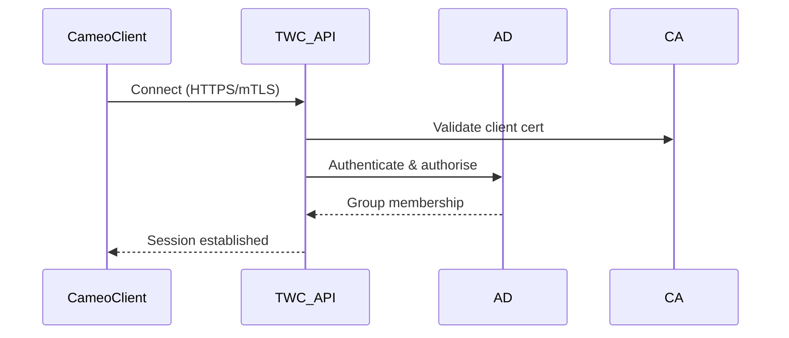
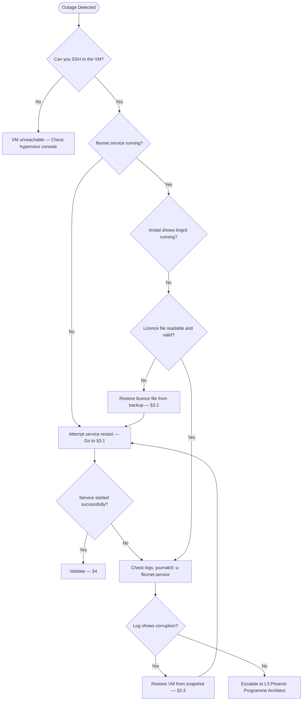
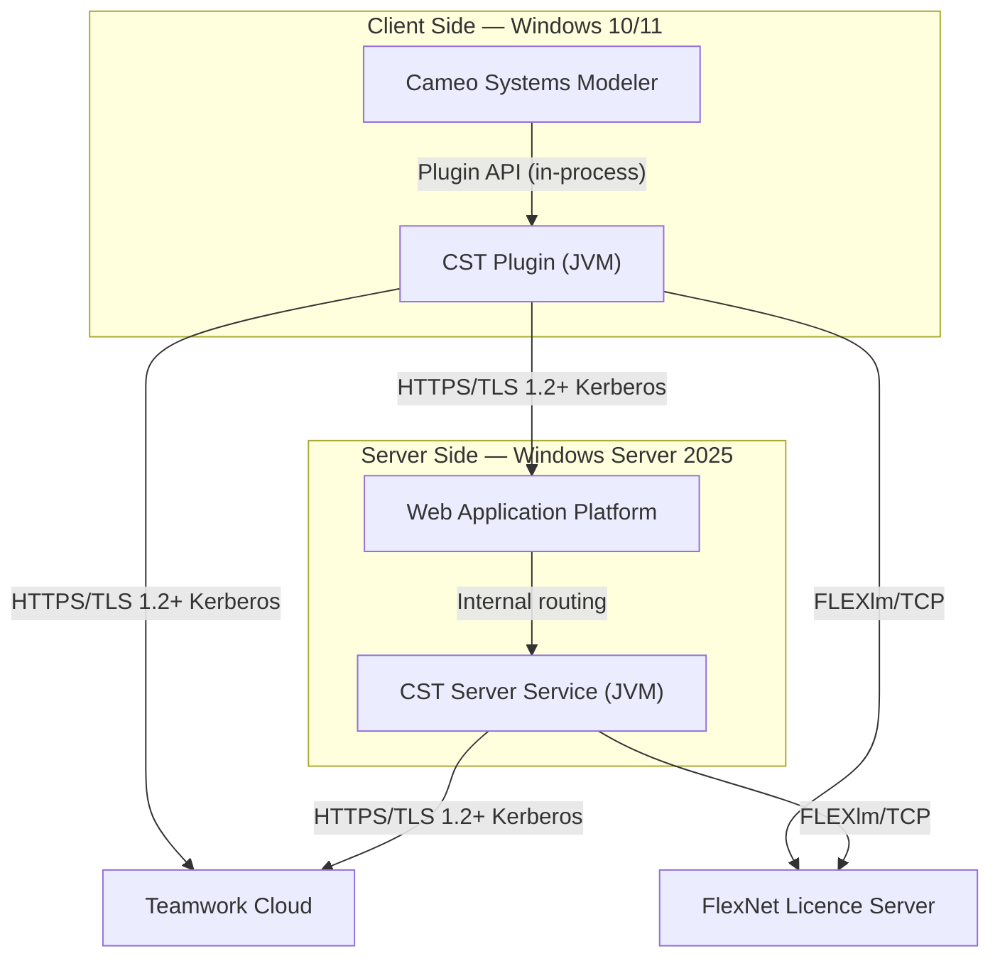

# Phoenix CAMEO — Master API & Integration Guide

> **Programme:** Phoenix CAMEO MBSE  
> **Document Type:** API / Integration Guide  
> **Generated:** 2026-04-08  
> **Components Covered:** WAP · TWC · FlexNet · CST · CSM

---

## Contents

- [WAP — Web Application Platform (WAP)](#wap--web-application-platform-wap)
- [TWC — Teamwork Cloud (TWC)](#twc--teamwork-cloud-twc)
- [FLEXNET — License Recovery & Failover Runbook](#flexnet--flexnet-license-server)
- [CST — Cameo Simulation Toolkit (CST)](#cst--cameo-simulation-toolkit-cst)
- [CSM — Cameo Systems Modeler (CSM)](#csm--cameo-systems-modeler-csm)

---

## WAP — Web Application Platform (WAP)

> **Source:** `wap/docs/05_api_integration_guide.md` | **Status:** Draft 0.2 | **Doc Ref:** WAP-DOC-05

# WAP-DOC-05 — API / Integration Guide

---

### 1. Authentication

**Session-Based Authentication (Browser Clients):**
```
POST /auth/login
Content-Type: application/x-www-form-urlencoded

username=firstname.lastname&password=<password>
```
Response: `Set-Cookie: WAPSESSION=<token>; HttpOnly; Secure; SameSite=Strict`

**API Token Authentication (Service Accounts):**
```
POST /api/v1/auth/token
Authorization: Basic <base64(username:password)>
```
Response includes Bearer JWT valid for 1 hour. Include as: `Authorization: Bearer <JWT>`

---

### 2. Error Codes

| Code | HTTP Status | Meaning |
|---|---|---|
| WAP-4001 | 401 | Unauthenticated — no valid session or token |
| WAP-4003 | 403 | Authorised user lacks required role |
| WAP-4004 | 404 | Requested resource or model not found |
| WAP-4029 | 429 | Rate limit exceeded |
| WAP-5001 | 503 | WAP cannot reach Teamwork Cloud |
| WAP-5002 | 503 | License server unavailable |

---

### 3. Key API Endpoints

**Model Browse:**
```
GET /api/v1/projects
GET /api/v1/projects/{projectId}/elements
GET /api/v1/projects/{projectId}/elements/{elementId}
Authorization: Bearer <token>
```

**Document Export:**
```
POST /api/v1/export/jobs
Authorization: Bearer <token>
Content-Type: application/json
{ "projectId": "...", "templateId": "...", "format": "pdf | docx" }

GET /api/v1/export/jobs/{jobId}          # Poll status
GET /api/v1/export/jobs/{jobId}/download  # Download result
```

**Simulation Jobs:**
```
POST /api/v1/simulation/jobs
Authorization: Bearer <token>
{ "projectId": "...", "simulationConfig": "...", "parameters": { "maxIterations": 1000 } }

GET    /api/v1/simulation/jobs/{jobId}          # Poll status
GET    /api/v1/simulation/jobs/{jobId}/results  # Get results
DELETE /api/v1/simulation/jobs/{jobId}          # Cancel job
```

---

### 4. Rate Limiting

| Endpoint Group | Limit |
|---|---|
| Authentication | 10 requests / minute |
| Model browse / element queries | 120 requests / minute |
| Export job submission | 5 jobs / minute |
| Simulation job submission | 3 jobs / minute |

On limit breach: `429 Too Many Requests` with `Retry-After` header.

---

## TWC — Teamwork Cloud (TWC)

> **Source:** `twc/docs/05_api_integration_guide.md` | **Status:** Not Started 0.1-DRAFT | **Doc Ref:** DOC-05

# DOC-05 — API / Integration Guide
## Teamwork Cloud Core Repository VM

---

### 1. TWC REST API Base URL

```
https://<twc-hostname>:8111/osmc
```

### 2. Authentication

```
POST /osmc/login
Content-Type: application/json
{ "username": "<AD_USER>", "password": "<AD_PASSWORD>" }
```

> Passwords must never be embedded in scripts. Use service accounts with secrets management.

### 3. Key Endpoints

| Endpoint | Method | Description |
|----------|--------|-------------|
| `/osmc/login` | POST | Obtain session token |
| `/osmc/resources/` | GET | List all resources |
| `/osmc/projects` | GET | List projects |

### 4. Integration Flow



### 5. Security Constraints

- All API traffic: HTTPS with mTLS
- No unauthenticated endpoints exposed
- API tokens expire per session policy
- No outbound internet access permitted

> ⚠️ **Status:** This document is Not Started. Full endpoint reference to be populated from official Teamwork Cloud API documentation.

---

## FLEXNET — FlexNet License Server

> **Source:** `flexnet/docs/05_license_recovery_failover_runbook.md` | **Status:** ✅ Complete | **Version:** 0.2.0

# 05 — License Recovery & Failover Runbook

**Classification:** OFFICIAL — SENSITIVE

> Recovery targets are **DRAFT** — subject to ISSO / AO approval before go-live.

---

### 1. RTO / RPO Targets

| Metric | Target (Draft) | Basis |
|--------|---------------|-------|
| Recovery Time Objective (RTO) | **4 hours** | Time from outage detection to service restored |
| Recovery Point Objective (RPO) | **24 hours** | Maximum data loss |
| Detection SLA | **15 minutes** | SIEM alert or user report to L1 on-call |

---

### 2. Triage Decision Tree



---

### 3. Recovery Procedures

**3.1 Service Restart (Fastest Path):**
```bash
ssh <YOUR_AD_ACCOUNT>@<FLEXNET_FQDN>
sudo systemctl restart flexnet.service
sleep 30
sudo systemctl status flexnet.service
/opt/flexnet/bin/lmutil lmstat -a -c /etc/flexnet/license.lic
```

**3.2 Restore Licence File from Backup:**
```bash
ls -lt /etc/flexnet/license.lic.bak_*
sudo cp /etc/flexnet/license.lic.bak_<DATE> /etc/flexnet/license.lic
sudo chown root:svc_flexnet /etc/flexnet/license.lic
sudo chmod 640 /etc/flexnet/license.lic
/opt/flexnet/bin/lmutil lmcksum -c /etc/flexnet/license.lic
sudo systemctl restart flexnet.service
```

**3.3 VM Snapshot Restore:**
1. Open vSphere Client and navigate to the FlexNet VM.
2. Power off VM → **Actions → Snapshots → Manage Snapshots**.
3. Select most recent pre-change snapshot → click **Revert**.
4. Power on the VM and verify service health.

**3.4 Firewall / Network Issues:**
```bash
sudo firewall-cmd --list-all
sudo firewall-cmd --permanent --add-port=27000/tcp
sudo firewall-cmd --permanent --add-port=<VENDOR_DAEMON_PORT>/tcp
sudo firewall-cmd --reload
ss -tlnp | grep 27000
```

---

### 4. Post-Recovery Validation

```bash
sudo systemctl status flexnet.service
/opt/flexnet/bin/lmutil lmstat -a -c /etc/flexnet/license.lic
/opt/flexnet/bin/lmutil lmstat -a -c /etc/flexnet/license.lic | grep "Users of"
curl -k -s -o /dev/null -w "HTTP %{http_code}\n" https://localhost:8090/
fips-mode-setup --check
getenforce
sudo tail -5 /var/log/flexnet/lmgrd.log
```

---

### 5. Escalation Contacts

| Level | Role | When |
|-------|------|------|
| L1 | FlexNet Operator (on-call) | First responder; initial triage |
| L2 | FlexNet Administrator | Service restart; licence file recovery |
| L3 | Phoenix Programme Architect | Snapshot restore; full rebuild; vendor engagement |
| ISSO | Information Systems Security Officer | Any security-relevant event; RTO exceeded |
| Vendor | Dassault Systèmes / Revenera | FlexNet Publisher defects |

---

## CST — Cameo Simulation Toolkit (CST)

> **Source:** `cst/docs/05_integration_guide.md` | **Status:** In Progress 0.2-DRAFT | **Doc Ref:** DOC-05

# DOC-05 — Integration Guide (CSM, WAP)

---

### 1. Integration Map



---

### 2. Interface Inventory

| Interface ID | From | To | Protocol | Port | Auth Method | TLS |
|-------------|------|----|---------|------|-------------|-----|
| INT-01 | CSM | CST Plugin | Plugin API (in-process) | N/A | N/A | N/A |
| INT-02 | CST Plugin | WAP | HTTPS | 443 | Kerberos (AD) | TLS 1.2+ |
| INT-04 | CST / Server | TWC | HTTPS | 443 | Kerberos (AD) | TLS 1.2+ |
| INT-05 | CST / Server | FlexNet | FLEXlm/TCP | 27000 | None (network-controlled) | None |
| INT-06 | CST / Server | Active Directory | LDAPS | 636 | Kerberos | TLS (LDAPS) |

> **GAP-03:** WAP integration API contract (INT-02) is not yet formally documented. The interface definition above is based on programme patterns. Formal contract must be obtained from the WAP PRD / WAP team before server-side mode can be declared production-ready.

---

### 3. CST ↔ WAP Integration (Server-Side Delegation)

**Delegation Request:**
```
POST https://<WAP_HOST>/api/cst/simulate
Authorization: Negotiate <Kerberos token>
Content-Type: application/json
{ "model_ref": "<MODEL_UUID>", "element_ref": "<ELEMENT_UUID>", "execution_params": { ... } }
```

**Response:** `HTTP 202 Accepted` with `Location: /api/cst/results/<RESULT_UUID>`

**Result Polling:**
```
GET https://<WAP_HOST>/api/cst/results/<RESULT_UUID>
Authorization: Negotiate <Kerberos token>
```
Returns `HTTP 200` with result payload when complete.

---

### 4. Integration Testing Checklist

| Test | Method | Pass Criteria |
|------|--------|--------------|
| CST plugin loads in CSM | Launch CSM; check `Tools → Plugins` | CST shown as Active |
| Licence checkout succeeds | Run a local test simulation | No licence error; simulation starts |
| TWC model read (TLS) | Run simulation on shared model | Model loads; TLS cert validated |
| WAP delegation (server-side) | Run server-side simulation as Specialist | 202 Accepted; result returned |
| WAP auth failure (wrong role) | Attempt server-side as CST_USER | 403 Forbidden returned to user |

---

## CSM — Cameo Systems Modeler (CSM)

> **Source:** `csm/docs/05_integration_guide.md` | **Status:** ✅ Done

# 05 — Integration Guide (License Server, TWC)

---

### 1. Licence Server Integration (FlexNet / DSLS)

**Connection Parameters:**

| Parameter | Value |
|---|---|
| Server Hostname | `<LICENCE_SERVER_HOSTNAME>` |
| Port (FlexNet) | `<PORT>` (default: 27000) |
| Port (DSLS) | `<PORT>` (default: 2000) |
| Protocol | TCP |
| Licence Type | Floating |

**Licence Checkout Behaviour:**

| Event | Behaviour |
|---|---|
| CSM launches | Contacts licence server; checks out one floating seat |
| No licence available | CSM displays an error and exits |
| CSM closes normally | Licence is returned immediately to the pool |
| CSM crashes | Licence held until FlexNet server-side timeout expires (typically 5–15 minutes) |

**Validate licence server integration:**
```cmd
python scripts\health_check.py
```

---

### 2. Teamwork Cloud Integration (Optional)

**Connection Parameters:**

| Parameter | Value |
|---|---|
| TWC Server Hostname | `<TWC_HOSTNAME>` |
| Port | 443 (HTTPS) |
| Authentication | AD SSO / local TWC account |
| TLS | Required — FIPS 140-3 compliant cipher suites |

**Enabling TWC in CSM:**
1. Go to **Collaborate → Options → Teamwork Cloud Server**.
2. Enter the TWC server hostname and port (443).
3. Select **HTTPS** as the connection protocol.
4. Confirm TLS validation is enabled — do not disable certificate verification.

---

### 3. Network Allow-List

| Source | Destination | Port | Protocol | Purpose |
|---|---|---|---|---|
| VDI Desktop | `<LICENCE_SERVER>` | `<PORT>` | TCP | Licence checkout |
| VDI Desktop | `<TWC_HOST>` | 443 | HTTPS | TWC (if enabled) |
| VDI Desktop | `<AD_DC>` | 88 / 389 | Kerberos/LDAP | AD Auth |

Reference: `config/network_allowlist.template`

---

*Generated: 2026-04-08 | Classification: OFFICIAL — SENSITIVE | Author: Iain Reid*
