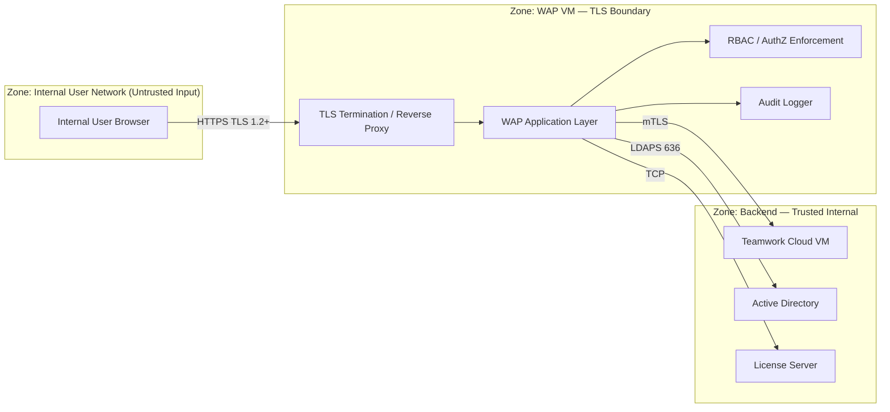

# Phoenix CAMEO — Master Security Analysis & Threat Model

> **Programme:** Phoenix CAMEO MBSE  
> **Document Type:** Security Analysis  
> **Generated:** 2026-04-08  
> **Components Covered:** WAP · TWC · FlexNet · CST · CSM

---

## Contents

- [WAP — Web Application Platform (WAP)](#wap--web-application-platform-wap)
- [TWC — Teamwork Cloud (TWC)](#twc--teamwork-cloud-twc)
- [FLEXNET — FlexNet License Server](#flexnet--flexnet-license-server)
- [CST — Cameo Simulation Toolkit (CST)](#cst--cameo-simulation-toolkit-cst)
- [CSM — Cameo Systems Modeler (CSM)](#csm--cameo-systems-modeler-csm)

---

## WAP — Web Application Platform (WAP)

> **Source:** `wap/docs/06_web_threat_model.md` | **Status:** Draft 0.2 | **Doc Ref:** WAP-DOC-06

# WAP-DOC-06 — Web Threat Model

---

### 1. Trust Boundaries

---

### 2. STRIDE Threat Assessment (WAP)

| Threat ID | STRIDE | Description | Mitigation | Residual Risk |
|---|---|---|---|---|
| STR-S01 | Spoofing | User credential theft via phishing | MFA enforcement at AD level; HSTS; no HTTP | Low |
| STR-S02 | Spoofing | Session token theft | HttpOnly + Secure cookie flags; TLS-only; CSP headers | Low |
| STR-S03 | Spoofing | Service account credential compromise | Credential vault; quarterly rotation | Medium |
| STR-T01 | Tampering | API parameter injection | Input schema validation; reject unknowns | Low |
| STR-T02 | Tampering | Log tampering | Logs forwarded to SIEM in near-real-time | Low |
| STR-I01 | Info Disclosure | Weak TLS cipher suite | TLS 1.2+ only; FIPS 140-3 cipher list | Low |
| STR-I02 | Info Disclosure | Verbose error messages | Generic user-facing error messages; full detail in server log | Low |
| STR-D01 | Denial of Service | Simulation job queue exhaustion | Per-user rate limits; max concurrent jobs | Medium |
| STR-E01 | Elevation of Privilege | RBAC bypass via direct API call | Role enforcement at API middleware | Low |
| STR-E03 | Elevation of Privilege | OS privilege escalation | WAP runs as non-root `wap` service account | Low |

---

### 3. OWASP Top 10 (2021) Mapping (WAP)

| OWASP Category | WAP-Specific Risk | Primary Control |
|---|---|---|
| A01 Broken Access Control | Unauthenticated API access | RBAC middleware at every endpoint |
| A02 Cryptographic Failures | Weak TLS / cipher negotiation | TLS 1.2+ only; FIPS 140-3 cipher suite |
| A03 Injection | API parameter injection; path traversal | Input schema validation; path allowlisting |
| A05 Security Misconfiguration | Default credentials; verbose error pages | STIG hardening; error message sanitisation |
| A07 Auth & Session Failures | Session hijacking; brute force | Secure cookies; AD lockout; rate limiting |
| A09 Security Logging Failures | Insufficient audit trail | SIEM forwarding; immutable log destination |
| A10 SSRF | WAP proxying attacker URLs to TWC | Allowlisted outbound destinations |

---

### 4. Security Headers (WAP)

| Header | Required Value |
|---|---|
| `Strict-Transport-Security` | `max-age=31536000; includeSubDomains` |
| `X-Content-Type-Options` | `nosniff` |
| `X-Frame-Options` | `DENY` |
| `Referrer-Policy` | `strict-origin-when-cross-origin` |
| `Cache-Control` | `no-store` on authenticated responses |

---

## TWC — Teamwork Cloud (TWC)

> **Source:** `twc/docs/06_security_analysis_threat_model.md` | **Status:** Not Started 0.1-DRAFT | **Doc Ref:** DOC-06

# DOC-06 — Security Analysis & Threat Model
## Teamwork Cloud Core Repository VM

---

### 1. Assets

| Asset | Sensitivity | Justification |
|-------|------------|---------------|
| TWC model repository | HIGH — OFFICIAL | Authoritative system models |
| Cassandra data files | HIGH | Persistent model data |
| AD credentials | HIGH | Authentication material |
| TLS private keys | CRITICAL | PKI material |
| Audit logs | HIGH | Compliance evidence |

---

### 2. Threat Analysis (STRIDE — TWC)

| Threat | Category | Likelihood | Impact | Control |
|--------|----------|-----------|--------|---------|
| Unauthenticated API access | Spoofing | Low | High | mTLS + AD auth |
| Data exfiltration via API | Information Disclosure | Medium | Critical | RBAC + audit logging |
| Cassandra direct access | Elevation of Privilege | Low | Critical | Localhost-only binding |
| Credential theft | Spoofing | Medium | High | No embedded creds; secrets mgmt |
| Denial of Service on JVM | Denial of Service | Low | High | Resource limits; monitoring |
| Tampered audit logs | Tampering | Low | High | Immutable log forwarding |

---

### 3. Security Controls (TWC)

| Control | Standard Reference | Implementation |
|---------|-------------------|---------------|
| Mutual TLS | NIST SC-8; FIPS 140-3 | Internal PKI; no self-signed |
| AD-based RBAC | NIST AC-2; AC-3 | AD groups → TWC roles |
| Encrypted data at rest | NIST SC-28 | OS-level encryption (where supported) |
| STIG-hardened OS | DISA STIG RHEL | Automated baseline |
| No outbound internet | NIST SC-7 | Firewall egress deny-all |
| Audit logging | NIST AU-2; AU-12 | Centralised syslog |

> ⚠️ **Status:** Residual risks to be completed after threat modelling workshop.

---

## FLEXNET — FlexNet License Server

> **Source:** `flexnet/docs/06_security_analysis.md` | **Status:** ✅ Complete | **Version:** 0.2.0

# 06 — Security Analysis

**Classification:** OFFICIAL — SENSITIVE

---

### 1. Threat Actors

| Actor | Likelihood | Capability | Primary Risk |
|-------|-----------|-----------|-------------|
| Malicious insider | Medium | High | Credential theft; licence file tampering; log deletion |
| Nation-state / APT | Low | Very High | Supply chain compromise; persistent access |
| Opportunistic internal attacker | Medium | Low–Medium | Denial of service; checkout squatting |
| Misconfiguration / human error | High | N/A | Service outage; licence exposure |

---

### 2. STRIDE Analysis (FlexNet)

| Threat | Component | Risk Level | Mitigation |
|--------|-----------|-----------|-----------|
| Spoofing | lmadmin login | High | AD Kerberos / LDAPS authentication; no anonymous access |
| Spoofing | lmgrd client connection | Medium | Source IP allow-list via firewalld |
| Tampering | Licence file | High | Filesystem ACLs (chmod 640, chown root:svc_flexnet); SHA-256 integrity check |
| Tampering | FlexNet binaries | Medium | `/opt/flexnet` owned by root; ProtectSystem=strict in systemd unit |
| Repudiation | Licence checkouts | Medium | lmgrd checkout events logged; forwarded to SIEM |
| Info Disclosure | lmgrd TCP traffic | Low | Network-layer control; checkout protocol plaintext (GAP-005 — residual) |
| Denial of Service | lmgrd port flood | High | firewalld source subnet restriction; systemd Restart=on-failure |
| Denial of Service | Licence exhaustion | Medium | Admin monitoring via lmadmin; lmremove procedure |
| Elevation of Privilege | OS | High | SELinux enforcing; STIG hardening; no root login via SSH |

---

### 3. Security Gap Register (FlexNet)

| GAP-ID | Description | Severity | Status |
|--------|-------------|----------|--------|
| GAP-001 | FlexNet Publisher TLS 1.2+ support for deployed version unconfirmed | High | Open |
| GAP-002 | lmadmin default credentials not yet rotated | High | Pre-deploy |
| GAP-003 | FIPS 140-3 kernel mode compatibility with FlexNet Publisher unconfirmed | High | Open |
| GAP-004 | All `<PLACEHOLDER>` values in `deployment.yaml` not yet replaced | Critical | Pre-deploy |
| GAP-005 | FlexNet checkout protocol (TCP 27000) is plaintext | Medium | Accepted (Residual) |
| GAP-006 | lmgrd does not perform client authentication | Medium | Accepted (Residual) |
| GAP-007 | Vendor daemon binary name and version not yet confirmed | Medium | Open |

---

### 4. Residual Risk

| Risk | Justification for Acceptance |
|------|------------------------------|
| Plaintext checkout protocol (GAP-005) | FlexNet Publisher architecture limitation; compensated by network segmentation |
| No client authentication at lmgrd (GAP-006) | FlexNet Publisher does not support client certificates; compensated by firewall allow-list |
| Single point of failure | Three-server redundancy not in programme scope; compensated by snapshot-based recovery (RTO 4h) |

---

## CST — Cameo Simulation Toolkit (CST)

> **Source:** `cst/docs/06_security_analysis_threat_model.md` | **Status:** In Progress 0.2-DRAFT | **Doc Ref:** DOC-06

# DOC-06 — Security Analysis & Threat Model (CST)

---

### 1. Trust Boundaries (CST)

| Boundary | Description | Key Risk |
|----------|-------------|----------|
| **A** | Client CST → WAP (HTTPS delegation) | Spoofed simulation requests; privilege escalation |
| **B** | CST → TWC (HTTPS model read) | Model content disclosure; data tampering in transit |
| **C** | CST → FlexNet (FLEXlm — unauthenticated) | Licence exhaustion (DoS); rogue clients |
| **D** | CST → AD (LDAPS identity) | Identity spoofing; group membership tampering |

---

### 2. STRIDE Threat Analysis (CST)

| ID | STRIDE | Affected Component | Mitigation | Residual Risk |
|----|--------|-------------------|------------|---------------|
| T-01 | Spoofing | WAP / Boundary A | Kerberos/SPNEGO auth enforced at WAP | Low |
| T-02 | Tampering | INT-04 / Boundary B | TLS 1.2+ enforced; certificate validation | Low |
| T-05 | Tampering / EoP | CST engine | No arbitrary code execution policy; model validation | Medium |
| T-07 | Denial of Service | Licence server | Firewall restricts FLEXlm port; licence pool monitoring | Medium |
| T-08 | Repudiation | Windows Event Log | All simulation launches logged with AD identity (NIST AU-2) | Low |
| T-10 | Cryptographic Failure | All server interfaces | FIPS 140-3 mode; TLS 1.0/1.1 disabled | Low |

---

### 3. Residual Risks (CST)

| Risk ID | Description | Likelihood | Impact | Accepted By |
|---------|-------------|-----------|--------|------------|
| RR-01 | Arbitrary code via crafted model (T-05) | Low | High | TA / Security Authority |
| RR-02 | FlexNet DoS via licence exhaustion (T-07) | Medium | Medium | TA |
| RR-03 | Unvalidated model input to CST engine (T-12) | Low | Medium | TA |

---

## CSM — Cameo Systems Modeler (CSM)

> **Source:** `csm/docs/06_security_analysis_threat_model.md` | **Status:** ✅ Done

# 06 — Security Analysis & Threat Model (CSM)

---

### 1. Assets

| Asset | Classification | Owner |
|---|---|---|
| SysML models (local workspace) | Sensitive — programme data | Systems Engineer |
| CSM application package | Controlled — approved software | MBSE Tool Admin |
| Floating licences | Business-critical | Infrastructure |
| User credentials | Sensitive | AD / IAM |

---

### 2. Threat Model (STRIDE — CSM)

| STRIDE | Threat | Mitigation | Status |
|---|---|---|---|
| Spoofing | User impersonation at Horizon login | AD Kerberos authentication; MFA where mandated | Implemented via AD |
| Spoofing | Fake licence server (DNS spoofing) | Allow-list firewall rules restrict connections to known licence server | Implemented |
| Tampering | Modification of Numecent package | Package signing enforced; integrity validation at launch | Implemented |
| Repudiation | Unlicensed use of CSM | FlexNet licence audit log records user, host, checkout/return timestamps | Implemented |
| Info Disclosure | Model data exfiltration via USB | USB device access restricted by VDI Group Policy | Implemented |
| Info Disclosure | Credentials leaked in package or config | No embedded credentials; AD auth only | Implemented |
| Denial of Service | Licence server unavailability | Licence server HA (Infrastructure team responsibility) | Partial — HA TBD |
| Elevation of Privilege | Local admin escalation on VDI | STIG/CIS hardening removes unnecessary local admin rights | Implemented |

---

### 3. Key Security Controls (CSM)

| Control | Standard Reference | Implementation |
|---|---|---|
| OS hardening | DISA STIG; CIS L2 | VDI gold image; `scripts/harden_vdi.ps1` |
| No internet access | NIST SC-7 | Network firewall allow-list only |
| No embedded credentials | NIST IA-5 | AD auth; no stored passwords in package |
| FIPS 140-3 cryptography | FIPS 140-3 | VDI OS + CSM JVM cryptographic providers |
| Package integrity | NIST SI-7 | Numecent signed package; `scripts/validate_package.py` |
| Audit logging | NIST AU-2 | VDI OS audit policy; FlexNet licence audit |

---

### 4. Residual Risks (CSM)

| Risk | Likelihood | Impact | Accepted By | Notes |
|---|---|---|---|---|
| Licence server single point of failure | Medium | High | Infrastructure | HA licence server is an Infrastructure team dependency |
| Licence borrow not enabled | Low | Medium | MBSE Tool Admin | Confirm FlexNet/DSLS borrow configuration with Infrastructure |
| JVM FIPS 140-3 certificate number not confirmed | Low | Low | CCO | Open item pending vendor confirmation |

---

*Generated: 2026-04-08 | Classification: OFFICIAL — SENSITIVE | Author: Iain Reid*
