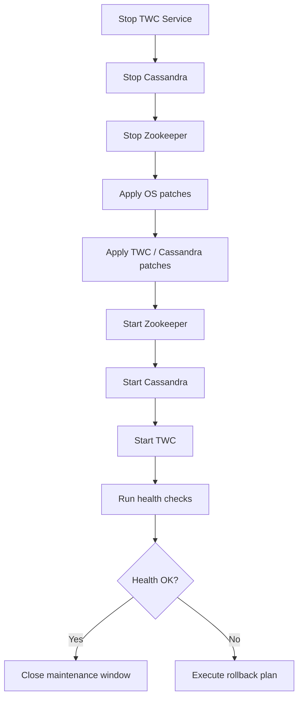

# Phoenix CAMEO — Master Maintenance & Patch Guide

> **Programme:** Phoenix CAMEO MBSE  
> **Document Type:** Maintenance Guide  
> **Generated:** 2026-04-08  
> **Components Covered:** WAP · TWC · FlexNet · CST · CSM

---

## Contents

- [WAP — Web Application Platform (WAP)](#wap--web-application-platform-wap)
- [TWC — Teamwork Cloud (TWC)](#twc--teamwork-cloud-twc)
- [FLEXNET — FlexNet License Server](#flexnet--flexnet-license-server)
- [CST — Cameo Simulation Toolkit (CST) — Performance Tuning Guide](#cst--cameo-simulation-toolkit-cst)
- [CSM — Cameo Systems Modeler (CSM)](#csm--cameo-systems-modeler-csm)

---

## WAP — Web Application Platform (WAP)

> **Source:** `wap/docs/10_maintenance_patch_guide.md` | **Status:** Draft 0.2 | **Doc Ref:** WAP-DOC-10

---

### Maintenance Schedule (WAP)

| Activity | Frequency | Owner | NIST Control |
|---|---|---|---|
| OS security patch review (errata) | Monthly | Platform Admin | SI-2 |
| OS security patch application | Monthly (after review) | Platform Admin | SI-2 |
| WAP application update review | Per vendor release | Platform Admin | SI-2 |
| TLS certificate expiry check | Monthly | Platform Admin | SC-8 |
| TLS certificate renewal | ≥ 60 days before expiry | Platform Admin + PKI | SC-8 |
| JVM heap and GC log review | Weekly | Platform Admin | CA-7 |
| Dependency CVE scan | Monthly | Security Team | SI-2 |
| Access review (RBAC) | Quarterly | Platform Admin + AO | AC-2 |
| Service account credential rotation | Quarterly | Platform Admin + ADA | IA-5 |

---

### Pre-Maintenance Checklist (WAP)

- [ ] Change request raised and approved in change management system
- [ ] Maintenance window communicated to users (via Service Desk)
- [ ] Configuration files backed up: `cp -rp /opt/nomagic/wap/conf/ /backup/wap-conf-$(date +%Y%m%d)/`
- [ ] TLS keystore and truststore backed up
- [ ] Current WAP version confirmed and recorded
- [ ] TWC VM confirmed as operational
- [ ] License server confirmed as operational
- [ ] VM snapshot taken (if VMware snapshot available and approved)

---

### OS Patching Procedure — WAP (RHEL / Rocky Linux)

```bash
# Check for available security updates
sudo dnf check-update --security

# Apply security patches only
sudo dnf update --security -y

# Check if kernel update is pending reboot
needs-restarting -r

# Reboot (during maintenance window only)
sudo reboot
```

**Post-patch verification:**
```bash
uname -r
sudo systemctl status 'wap-*.service'
journalctl -u wap-core.service --since "30 minutes ago"
```

---

### Post-Maintenance Smoke Tests (WAP)

| Test | Command / Action | Expected Result |
|---|---|---|
| All services running | `systemctl is-active 'wap-*.service'` | All `active` |
| Web UI accessible | Browse `https://<wap-hostname>/` | HTTP 200, no cert warning |
| AD login functional | Login with test AD account | Successful login |
| Model browsable | Open Collaborator, navigate to a model | Model elements visible |
| Document export functional | Submit a small export job | Job completes, download available |
| TWC connectivity | `curl -k https://<twc>:8111/osmc/ping` | HTTP 200 |
| TLS certificate valid | `echo Q \| openssl s_client -connect <wap-hostname>:443 2>/dev/null \| openssl x509 -noout -dates` | Not expired |

---

## TWC — Teamwork Cloud (TWC)

> **Source:** `twc/docs/10_maintenance_patch_guide.md` | **Status:** Not Started 0.1-DRAFT | **Doc Ref:** DOC-10

---

### Maintenance Schedule (TWC)

| Activity | Frequency | Owner | Window |
|----------|-----------|-------|--------|
| OS security patches | Monthly | TA / CO | Scheduled maintenance window |
| TWC application patches | Per vendor release | TA | Scheduled maintenance window |
| TLS certificate review | Quarterly | TA / CO | Out-of-hours |
| Disk space review | Weekly | TA | Automated alert |
| Full backup verification | Monthly | TA | Scheduled |

---

### Patch Application Order (TWC)



---

### Rollback Procedure (TWC)

If post-patch verification fails:

1. Stop all services (TWC → Cassandra → Zookeeper)
2. Restore from pre-patch backup (see MASTER_11_supplementary.md — TWC section)
3. Start services in dependency order
4. Re-run health checks
5. Raise incident and notify CO

---

## FLEXNET — FlexNet License Server

> **Source:** `flexnet/docs/10_maintenance_patch_guide.md` | **Status:** ✅ Complete | **Version:** 0.2.0

---

### Maintenance Schedule (FlexNet)

| Activity | Frequency | Agreed Window | Owner |
|----------|-----------|--------------|-------|
| OS security patches | Monthly | `<MAINTENANCE_WINDOW>` | SA |
| FlexNet Publisher updates | As released and tested | Change-controlled | FNA |
| VM snapshot (automated) | Weekly | Automated | SA |
| VM snapshot (manual) | Pre/post every change | Before each change | SA |
| Audit log review | Weekly | `<LOG_REVIEW_DAY>` | ISSO |
| RBAC / account review | Quarterly | `<QUARTERLY_REVIEW_DATE>` | PA + ISSO |
| TLS certificate renewal | 30 days before expiry | Change-controlled | FNA |
| Licence expiry monitoring | Ongoing | Alert at 60-day and 30-day thresholds | FNA |
| Full compliance audit (SCAP) | Annual | `<ANNUAL_AUDIT_DATE>` | ISSO + SA |

---

### Pre-Maintenance Checklist (FlexNet)

```markdown
Pre-Maintenance Checklist
─────────────────────────
[ ] Change request raised and approved
[ ] Maintenance window communicated to all affected users (CSM/CST/TWC/WAP)
[ ] Current lmstat output captured:
      /opt/flexnet/bin/lmutil lmstat -a -c /etc/flexnet/license.lic > /tmp/lmstat_pre_$(date +%Y%m%d_%H%M).txt
[ ] Confirm no active borrow sessions that would be disrupted
[ ] VM snapshot taken and labelled: flexnet-lsvm-pre-CHG<NUMBER>-<DATE>
[ ] Licence file SHA-256 captured:
      sha256sum /etc/flexnet/license.lic
```

---

### OS Patching (Air-Gapped RHEL 9 — FlexNet)

```bash
# Check available updates
sudo dnf check-update

# Apply security patches only
sudo dnf update --security -y

# If new kernel was installed, reboot
needs-restarting -r && sudo systemctl reboot

# Post-kernel-update verification
fips-mode-setup --check
getenforce
sudo systemctl status flexnet.service
/opt/flexnet/bin/lmutil lmstat -a -c /etc/flexnet/license.lic
```

---

### TLS Certificate Renewal (FlexNet)

```bash
# Monitor certificate expiry
openssl x509 -in /etc/flexnet/tls/server.crt -noout -enddate

# After receiving new certificate from internal CA
sudo cp /etc/flexnet/tls/server.crt /etc/flexnet/tls/server.crt.bak_$(date +%Y%m%d)
sudo cp /tmp/new_server.crt /etc/flexnet/tls/server.crt
sudo chown root:svc_flexnet /etc/flexnet/tls/server.crt
sudo chmod 440 /etc/flexnet/tls/server.crt
sudo systemctl restart flexnet.service
openssl s_client -connect localhost:8090 -CAfile /etc/flexnet/tls/ca-chain.crt < /dev/null 2>/dev/null | openssl x509 -noout -enddate
```

---

## CST — Cameo Simulation Toolkit (CST)

> **Source:** `cst/docs/10_simulation_performance_tuning_guide.md` | **Status:** In Progress 0.2-DRAFT | **Doc Ref:** DOC-10

> **Note:** The CST equivalent of a maintenance guide is the Simulation Performance Tuning Guide. Standard OS maintenance for the Windows Server 2025 host follows programme-standard Windows patch procedures.

---

### Performance Objectives (CST)

| Metric | Client-Side Target | Server-Side Target |
|--------|------------------|------------------|
| Simulation startup time | < 30 seconds | < 60 seconds |
| Execution determinism | 100% reproducible | 100% reproducible |
| JVM heap usage (peak) | ≤ 75% of `-Xmx` | ≤ 75% of `-Xmx` |

> **Non-functional requirement:** Simulation execution must be deterministic — results must be 100% reproducible across identical inputs. Performance tuning must never compromise determinism.

---

### JVM Configuration (CST)

**Heap Settings:**

| Parameter | Client-Side (Windows 10/11) | Server-Side (Windows Server 2025) |
|-----------|---------------------------|----------------------------------|
| `-Xms` (initial heap) | `512m` | `1024m` |
| `-Xmx` (maximum heap) | `2048m` | `4096m` |
| `-XX:MetaspaceSize` | `256m` | `512m` |
| `-XX:MaxMetaspaceSize` | `512m` | `1024m` |

> **Client-side constraint:** Do not exceed 50% of available physical RAM for `-Xmx` on client workstations.

**Recommended additional JVM flags:**
```properties
-XX:+HeapDumpOnOutOfMemoryError
-XX:HeapDumpPath=<REPLACE_ME_LOG_PATH>\cst_heap_dump.hprof
-XX:+ExitOnOutOfMemoryError
-Dfile.encoding=UTF-8
```

---

### Model Complexity Guidelines (CST)

| Model Type | Complexity Indicators | Expected Resource Impact | Recommended Mode |
|------------|----------------------|------------------------|-----------------|
| State machines (simple) | < 20 states; < 50 transitions | Low heap; < 5 seconds | Local (client-side) |
| State machines (complex) | > 50 states; nested composite states | Medium heap | Local or server-side |
| Parametric models (complex) | > 50 constraint blocks; recursive constraints | High heap | Server-side preferred |
| Executable constraint blocks | Integration with external solver | High heap; variable runtime | Server-side preferred |

---

### Server-Side Resource Allocation (CST)

| Resource | Minimum | Recommended |
|----------|---------|-------------|
| vCPU | 4 | 8 |
| RAM | 8 GB | 16 GB |
| Disk (result store) | 50 GB | 200 GB |
| Disk (OS + application) | 80 GB | 120 GB |

---

## CSM — Cameo Systems Modeler (CSM)

> **Source:** `csm/docs/10_maintenance_patch_guide.md` | **Status:** ✅ Done

---

### Maintenance Schedule (CSM)

| Activity | Frequency | Owner | Notes |
|---|---|---|---|
| VDI OS security patching | Monthly | VDI Platform Engineer | Patch Tuesday + 2 weeks max |
| CSM version update | As vendor releases | MBSE Tool Admin | Approval required before deployment |
| JVM update (embedded) | With CSM package | MBSE Tool Admin | Vendor-packaged JVM only |
| STIG/CIS re-validation | After each OS patch | CCO | Re-run hardening check |
| Licence server health check | Weekly | MBSE Tool Admin | `scripts/health_check.py` |
| AV exclusion review | Quarterly | CCO + MBSE Tool Admin | Validate exclusions still required |
| Package integrity check | Monthly | MBSE Tool Admin | `scripts/validate_package.py` |

---

### VDI OS Patching Procedure (CSM)

**Pre-Patch:**
1. Confirm a maintenance window has been agreed with affected users and teams.
2. Take a **snapshot** of the current VDI gold image.
3. Notify MBSE Tool Administrators that the VDI pool will be unavailable.
4. Confirm all users have closed CSM and released their licences.

**Apply Patches:**
1. Connect to the VDI gold image in Horizon Administrator Console.
2. Open Windows Update (via WSUS — no direct internet access).
3. Download and install all approved patches (Critical and High mandatory).

**Post-Patch Validation:**
```powershell
.\scripts\harden_vdi.ps1 -Mode Validate
```
Launch CSM and confirm startup and licence checkout succeed:
```cmd
python scripts\health_check.py
```

---

### CSM Version Update Procedure

**Key Steps:**
1. Verify the installer checksum against the vendor-provided SHA-256 hash.
2. Repackage in Numecent capture mode with the new CSM release and approved JVM options.
3. Publish to **test** Numecent group only; confirm on a test VDI before production.
4. Obtain sign-off from Lead Architect before publishing to production.

**Rollback:**
In the Numecent Cloudpaging Administrator Console, set the **previous version** as Active. Users revert on next launch.

---

### Change Management (CSM)

All changes to CSM package, JVM configuration, VDI gold image, network allow-list, or AV exclusions must:

1. Raise a **Change Request (CR)** in the programme ITSM tool.
2. Obtain approval from the Change Advisory Board (CAB).
3. Schedule within an agreed maintenance window.
4. Execute following the relevant procedure in this guide.
5. Validate and close the CR with evidence of successful completion.

---

*Generated: 2026-04-08 | Classification: OFFICIAL — SENSITIVE | Author: Iain Reid*
