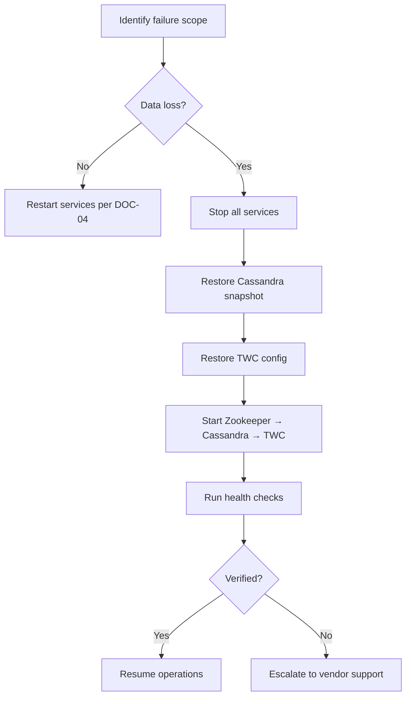
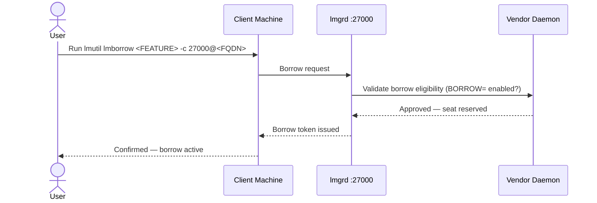
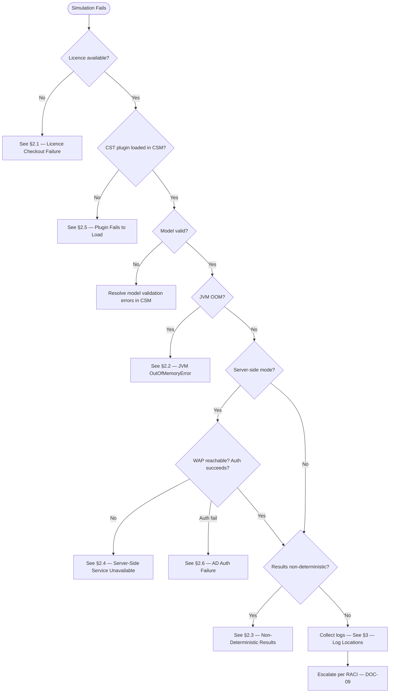
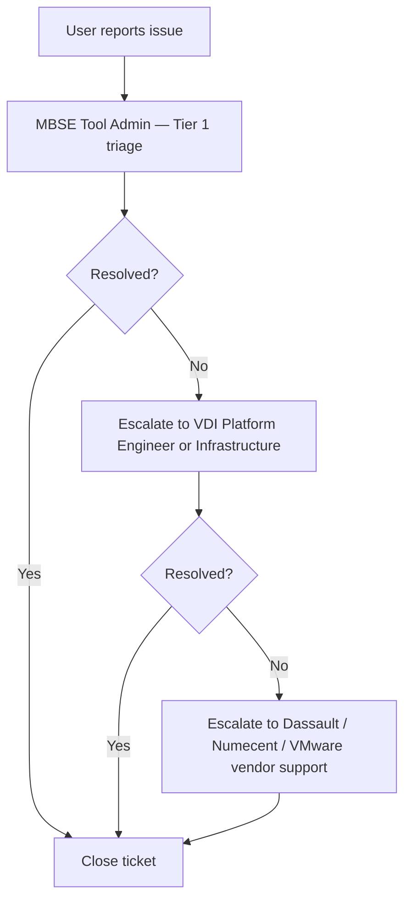

# Phoenix CAMEO — Master Supplementary Guides

> **Programme:** Phoenix CAMEO MBSE  
> **Document Type:** Supplementary / Specialist Guide  
> **Generated:** 2026-04-08  
> **Components Covered:** WAP · TWC · FlexNet · CST · CSM

> **Note:** This master document consolidates specialist supplementary guides from each component. These guides cover specialist operational domains not covered by the other 11 document types.

---

## Contents

- [WAP — Simulation Services Operational Guide](#wap--web-application-platform-wap)
- [TWC — Backup & Recovery Guide](#twc--teamwork-cloud-twc)
- [FLEXNET — Offline Licence Borrow Procedure](#flexnet--flexnet-license-server)
- [CST — Failure & Troubleshooting Guide](#cst--cameo-simulation-toolkit-cst)
- [CSM — Incident & Support Runbook](#csm--cameo-systems-modeler-csm)

---

## WAP — Web Application Platform (WAP)

> **Source:** `wap/docs/12_simulation_services_guide.md` | **Status:** Draft 0.2 | **Doc Ref:** WAP-DOC-12

# WAP-DOC-12 — Simulation Services Operational Guide

---

### 1. Architecture — Simulation Services (WAP)

```mermaid
graph LR
    subgraph WAP_VM["WAP VM"]
        API[WAP API Layer]
        QUEUE[Job Queue]
        POOL[CST Worker Pool - wap-cst.service]
        RESULT[Result Cache - ephemeral]
        API --> QUEUE
        QUEUE --> POOL
        POOL --> RESULT
    end

    USER[User / API Client] -->|POST /api/v1/simulation/jobs| API
    POOL -->|Fetch model| TWC[Teamwork Cloud VM]
    POOL -->|Checkout license| LIC[License Server VM]
    USER -->|GET /api/v1/simulation/jobs/{id}/results| API
```

---

### 2. Simulation Job Lifecycle

```mermaid
stateDiagram-v2
    [*] --> Submitted : User submits job via API or web UI
    Submitted --> Queued : Job accepted; awaits worker
    Queued --> LicenseCheck : Worker picks up job
    LicenseCheck --> Running : License checked out successfully
    LicenseCheck --> Failed : License unavailable
    Running --> Completed : Simulation finishes successfully
    Running --> Failed : Runtime error or timeout
    Completed --> ResultAvailable : Results stored in ephemeral cache
    ResultAvailable --> [*] : User downloads results
```



---

### 3. Submitting a Simulation Job (WAP)

**Via REST API:**
```bash
curl -s -X POST https://<wap-hostname>/api/v1/simulation/jobs \
  -H "Authorization: Bearer <token>" \
  -H "Content-Type: application/json" \
  -d '{
    "projectId": "<TWC project UID>",
    "simulationConfig": "<simulation configuration element UID>",
    "parameters": { "maxIterations": 1000, "timeoutSeconds": 600 }
  }'
```

---

### 4. Troubleshooting — Simulation Services (WAP)

| Symptom | Likely Cause | Resolution |
|---------|-------------|-----------|
| Job stuck in `queued` indefinitely | Worker pool exhausted | Check concurrent job count; increase pool size or wait |
| Job transitions to `failed` immediately | License unavailable | Check license server connectivity; verify available CST licenses |
| Job fails with "Model not found" | Incorrect UID | Verify UIDs via the model browse API |
| Job fails with "Timeout" | Simulation exceeded `timeoutSeconds` | Increase timeout parameter or optimise model |

---

### 5. Capacity and Queue Configuration (WAP)

Configuration in `/opt/nomagic/cst/conf/cst.properties`:
```properties
cst.worker.pool.size=4
cst.queue.max.depth=20
cst.user.max.concurrent.jobs=2
cst.default.timeout.seconds=600
cst.result.ttl.seconds=3600
```

> **Guidance:** Set `cst.worker.pool.size` to no more than (total vCPU / 2) to avoid saturating the host.

---

## TWC — Teamwork Cloud (TWC)

> **Source:** `twc/docs/11_backup_recovery_guide.md` | **Status:** Not Started 0.1-DRAFT | **Doc Ref:** DOC-11

# DOC-11 — Backup & Recovery Guide
## Teamwork Cloud Core Repository VM

---

### 1. Backup Scope (TWC)

| Component | Data | Backup Method |
|-----------|------|--------------|
| Cassandra | Model data (keyspaces) | `nodetool snapshot` |
| TWC config | Application config files | File-level backup |
| Zookeeper | Coordination data | File-level backup |
| OS config | `/etc`, systemd units | File-level backup |
| Audit logs | `/var/log/audit/` | Forwarded + archived |

---

### 2. Backup Schedule (TWC)

| Type | Frequency | Retention | Storage Target |
|------|-----------|-----------|----------------|
| Full Cassandra snapshot | Daily | 30 days | Offline backup store |
| TWC config backup | Weekly | 90 days | Offline backup store |
| Pre-patch backup | Before every patch | Until next patch | Offline backup store |

---

### 3. Cassandra Snapshot Procedure

```bash
# Create a named snapshot
nodetool snapshot -t twc-backup-YYYY-MM-DD

# Copy snapshot to offline backup store
rsync -av /var/lib/cassandra/data/ <BACKUP_TARGET_PATH>/cassandra/YYYY-MM-DD/
```

---

### 4. Recovery Procedure (TWC)



---

### 5. Recovery Testing (TWC)

- Full recovery test conducted: **monthly**
- Test must confirm data integrity by verifying a known project is accessible post-restore

> ⚠️ **Status:** This document is Not Started. Full procedures require completion.

---

## FLEXNET — FlexNet License Server

> **Source:** `flexnet/docs/11_offline_borrow_procedure.md` | **Status:** ✅ Complete | **Version:** 0.2.0

# 11 — Offline Borrow Procedure

**Classification:** OFFICIAL — SENSITIVE

> **Approval required:** Offline borrow must be pre-approved by the FlexNet Administrator.

---

### 1. Borrow Procedure (Client Side)

**Step 1 — Check Current Borrow Availability:**
```bash
lmutil lmborrow -status -c 27000@<FLEXNET_FQDN>
```

**Step 2 — Set the Borrow End Date:**
```bash
# Linux / macOS
export BORROW_UNTIL="<MM/DD/YYYY>"

# Windows (Command Prompt)
set LM_BORROW_EXPIRED=<MM/DD/YYYY>
```

**Step 3 — Borrow the Licence:**
```bash
lmutil lmborrow <FEATURE_NAME> -c 27000@<FLEXNET_FQDN>
```

**Step 4 — Verify the Borrow is Active:**
```bash
lmutil lmborrow -status -c 27000@<FLEXNET_FQDN>
```



---

### 2. Return Procedure (Before Expiry — Recommended)

```bash
# Reconnect to the enclave network first
nc -zv <FLEXNET_FQDN> 27000

# Return the borrowed licence
lmutil lmborrow -return <FEATURE_NAME> -c 27000@<FLEXNET_FQDN>

# Confirm the return was successful
lmutil lmborrow -status -c 27000@<FLEXNET_FQDN>
```

---

### 3. Expiry Behaviour

| Scenario | Behaviour |
|----------|-----------|
| Still offline at expiry | Application will fail to open at the next licence check interval |
| Reconnected before expiry | Return the licence early per §2 |
| Reconnected after expiry | Licence is automatically released back to the pool on reconnect |

---

### 4. Troubleshooting (Borrow)

| Symptom | Likely Cause | Resolution |
|---------|-------------|-----------|
| "BORROW not available for feature" | `BORROW=` not set in the `INCREMENT` line | Contact administrator — may need a licence file update |
| "No borrow slots available" | Maximum concurrent borrows reached | Contact administrator |
| "Cannot connect to server" at borrow time | Client not connected to enclave network | Connect to the network first |
| Borrow expired while offline — tool stops | Did not return before expiry | Reconnect to enclave — borrow released automatically |

---

## CST — Cameo Simulation Toolkit (CST)

> **Source:** `cst/docs/11_failure_troubleshooting_guide.md` | **Status:** In Progress 0.2-DRAFT | **Doc Ref:** DOC-11

# DOC-11 — Failure & Troubleshooting Guide (CST)

---

### 1. Master Diagnostic Flow (CST)



---

### 2. Common Failure Scenarios (CST)

**2.1 Licence Checkout Failure:**

| Step | Action |
|------|--------|
| 1 | Test connectivity: `Test-NetConnection -ComputerName <FLEXNET_HOSTNAME> -Port <PORT>` |
| 2 | If pool exhausted: wait for active simulations to complete |
| 3 | If FlexNet unreachable: Platform Operations to verify FlexNet service status |
| 4 | Verify config: MBSE Tool Administrator to confirm `config/licence.properties` |

**2.2 JVM OutOfMemoryError:**

1. **Immediate workaround:** Switch to server-side execution mode.
2. **Increase client-side heap:** Edit `<CSM_INSTALL_DIR>\bin\csm.vmoptions` — increase `-Xmx` (do not exceed 50% of physical RAM).
3. **Increase server-side heap:** Platform Operations to increase `jvm.heap.max` in `config/cst_server.properties` and restart the CST Server Service.

**2.3 Non-Deterministic Results:**

> **This is a P2 incident** — report immediately to the Simulation Specialist and MBSE Tool Administrator. Non-deterministic simulation results must **not** be used as design evidence until root cause is identified and resolved.

**2.4 Server-Side Service Unavailable:**
```powershell
Test-NetConnection -ComputerName <WAP_HOST> -Port 443
Get-Service -Name "cst*"
Restart-Service -Name "cst*"
python scripts\health_check.py
```

**2.6 AD Authentication Failure:**
```powershell
# Verify AD group membership
Get-ADPrincipalGroupMembership -Identity $env:USERNAME | Where-Object { $_.Name -like "CST*" }

# Refresh Kerberos ticket
klist purge

# Check clock skew
w32tm /query /status
```

---

### 3. Log Locations (CST)

| Log | Default Location | Platform |
|-----|-----------------|---------|
| CSM application log | `%APPDATA%\No Magic\Cameo Systems Modeler\<version>\log\` | Windows 10/11 |
| Windows Event Log (Application) | `eventvwr.msc → Windows Logs → Application` | Windows Server 2025 |
| Windows Event Log (Security) | `eventvwr.msc → Windows Logs → Security` | Windows Server 2025 |
| WAP service log | WAP log directory (see WAP PRD) | Windows Server 2025 |
| FlexNet licence log | FlexNet server host — lmadmin debug log | FlexNet server |

---

### 4. First-Response Diagnostic Commands (CST)

```powershell
# FIPS mode verification
Get-ItemProperty -Path "HKLM:\SYSTEM\CurrentControlSet\Control\Lsa\FipsAlgorithmPolicy" -Name Enabled

# Firewall profiles enabled
Get-NetFirewallProfile | Select-Object Name, Enabled

# FlexNet connectivity test
Test-NetConnection -ComputerName <FLEXNET_HOSTNAME> -Port <FLEXNET_PORT>

# WAP/CST server connectivity
Test-NetConnection -ComputerName <WAP_HOSTNAME> -Port 443

# User's CST group membership
Get-ADPrincipalGroupMembership -Identity $env:USERNAME | Where-Object { $_.Name -like "CST*" }

# Recent Application Event Log errors
Get-WinEvent -LogName Application -MaxEvents 50 |
  Where-Object { $_.LevelDisplayName -in @("Error","Critical") } |
  Select-Object TimeCreated, ProviderName, Message
```

---

## CSM — Cameo Systems Modeler (CSM)

> **Source:** `csm/docs/11_incident_support_runbook.md` | **Status:** ✅ Done

# 11 — Incident & Support Runbook (CSM)

---

### 1. Incident Severity Levels (CSM)

| Level | Definition | Response Time Target |
|---|---|---|
| P1 — Critical | All CSM users unable to work | Immediate |
| P2 — High | Multiple users affected; workaround unavailable | `<TARGET>` |
| P3 — Medium | Single user affected; workaround available | `<TARGET>` |
| P4 — Low | Minor issue; cosmetic or informational | `<TARGET>` |

---

### 2. Escalation Path (CSM)



---

### 3. Common Incidents (CSM)

**CSM Fails to Launch:**
| Step | Action |
|---|---|
| 1 | Check Numecent Cloudpaging client service is running: `services.msc` → Numecent service → **Running** |
| 2 | Check Numecent Cloudpaging Administrator Console — CSM package published and Active |
| 3 | Run `scripts/validate_package.py` to check package integrity |
| 4 | Check Windows Event Viewer: `Applications and Services Logs → Numecent` for error codes |
| 5 | If package appears corrupt, roll back to previous package version |

**Licence Unavailable:**
| Step | Action |
|---|---|
| 1 | Run `scripts/health_check.py` — confirm licence server hostname resolves and TCP port reachable |
| 2 | Log in to FlexNet/DSLS admin console — check Licence Usage dashboard |
| 3 | Identify orphaned checkouts and reclaim if the associated VDI session is confirmed dead |
| 4 | If licence server is unreachable (not just no seats), escalate to Infrastructure immediately (P1) |

**Poor Performance / Slow Model Load:**
| Step | Action |
|---|---|
| 1 | Check VDI vCPU and RAM allocation in Horizon Console — confirm minimum 4 vCPU / 16 GB RAM |
| 2 | Check Windows Task Manager on the VDI for CPU/RAM usage at launch |
| 3 | Confirm JVM heap settings match `config/jvm_options.template` approved values |
| 4 | Check local VDI disk free space — minimum 40 GB free required |

---

### 4. Contact Directory (CSM)

| Contact | Role | When to Escalate |
|---|---|---|
| MBSE Tool Admin | Tier 1 — CSM / Numecent | CSM launch failures, package issues, licence admin |
| VDI Platform Engineer | Tier 2 — Horizon / VDI OS | VDI connectivity, pool issues, OS patching |
| Infrastructure / Network | Tier 2 — Network / Licence Server | Licence server unreachable, network issues |
| TWC Admin | Tier 2 — Teamwork Cloud | TWC connectivity, server outage |
| Dassault Systèmes Support | Vendor — CSM | CSM application bugs |
| Numecent Support | Vendor — Application Virtualisation | Numecent Cloudpaging issues |

> **Note:** Contact details (`<CONTACT>`, `<VENDOR_PORTAL>`) must be populated by the MBSE Tool Admin prior to deployment.

---

*Generated: 2026-04-08 | Classification: OFFICIAL — SENSITIVE | Author: Iain Reid*
