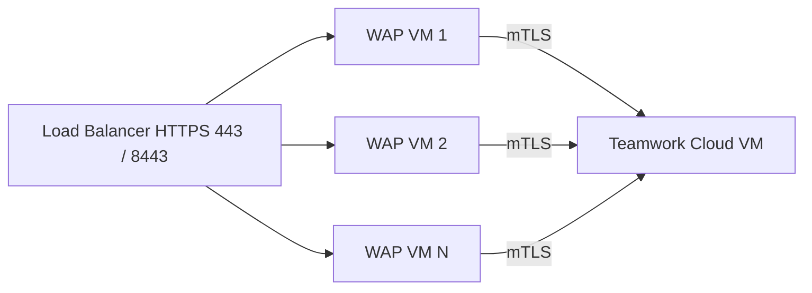
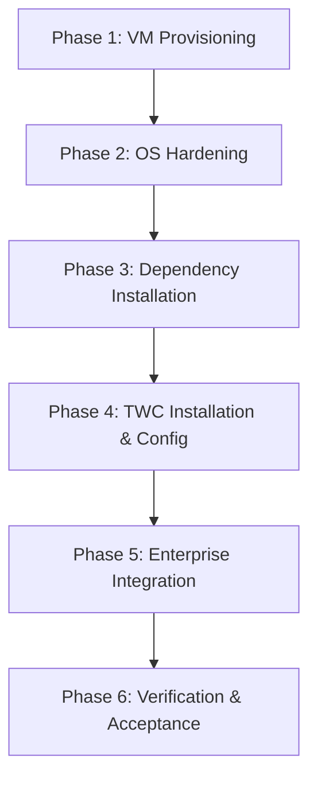
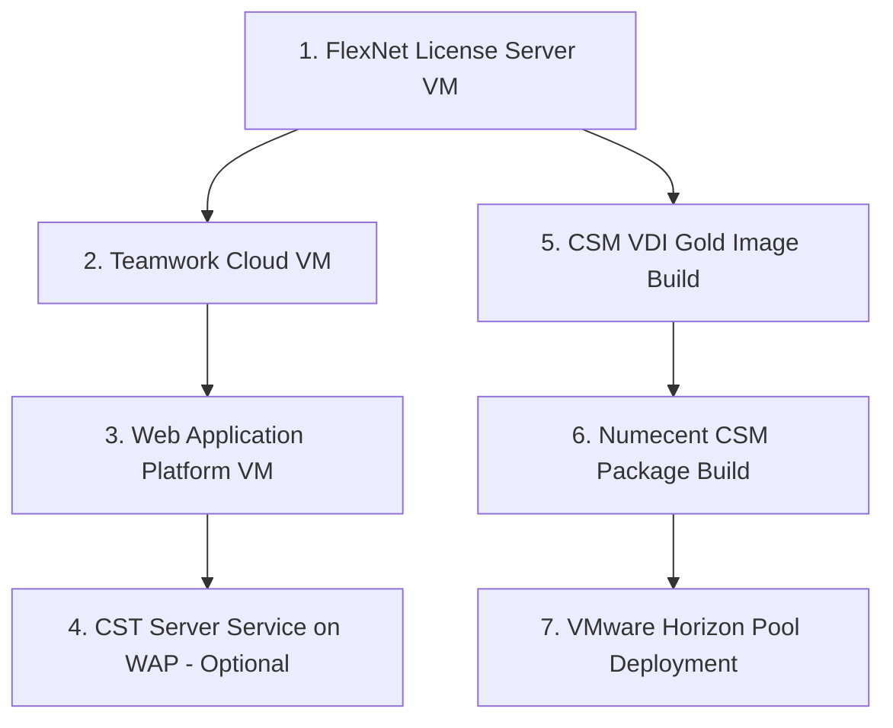

# Phoenix CAMEO — Master Deployment & Build Guide

> **Programme:** Phoenix CAMEO MBSE  
> **Document Type:** Deployment Guide  
> **Generated:** 2026-04-08  
> **Components Covered:** WAP · TWC · FlexNet · CST · CSM

---

## Contents

- [WAP — Web Application Platform (WAP)](#wap--web-application-platform-wap)
- [TWC — Teamwork Cloud (TWC)](#twc--teamwork-cloud-twc)
- [FLEXNET — FlexNet License Server](#flexnet--flexnet-license-server)
- [CST — Cameo Simulation Toolkit (CST)](#cst--cameo-simulation-toolkit-cst)
- [CSM — Cameo Systems Modeler (CSM)](#csm--cameo-systems-modeler-csm)

---

## WAP — Web Application Platform (WAP)

> **Source:** `wap/docs/11_deployment_scaling_guide.md` | **Status:** Draft 0.2 | **Doc Ref:** WAP-DOC-11

# WAP-DOC-11 — Deployment & Scaling Guide

---

### 1. Prerequisites (WAP)

All items below must be completed and confirmed before WAP deployment begins:

| # | Prerequisite | Owner | Confirmed |
|---|---|---|---|
| 1 | WAP VM provisioned: OS installed (RHEL 8+ / Rocky Linux 8+) | Infrastructure / NET | ⬜ |
| 2 | TWC VM operational and reachable on port 8111 from WAP VM | Platform Admin / NET | ⬜ |
| 3 | Active Directory reachable on LDAPS port 636 from WAP VM | ADA / NET | ⬜ |
| 4 | License Server (FlexNet / DSLS) reachable from WAP VM | Platform Admin / NET | ⬜ |
| 5 | Internal PKI root and intermediate CA certificates available | PKI Team | ⬜ |
| 6 | TLS server certificate issued for WAP hostname | PKI Team | ⬜ |
| 7 | DNS A record created for `<wap-hostname>` | NET | ⬜ |
| 8 | Firewall rules applied | NET | ⬜ |
| 9 | AD service accounts created: `svc-wap-twc`, `svc-wap-bind` | ADA | ⬜ |
| 10 | WAP installer obtained from No Magic / DS portal | Platform Admin | ⬜ |

---

### 2. VM Hardware Specification (WAP)

| Resource | Minimum | Recommended |
|---|---|---|
| vCPU | 4 | 8 |
| RAM | 16 GB | 32 GB |
| OS Disk | 40 GB | 60 GB |
| WAP Install Disk | 60 GB | 100 GB |
| OS | RHEL 8.x / Rocky Linux 8.x | Latest minor release |
| JVM | OpenJDK 11 or IBM Semeru 11 (FIPS-capable) | Confirm with vendor |

---

### 3. Deployment Steps (WAP)

**Phase 1 — OS Hardening:**
```bash
# Apply all OS updates
sudo dnf update -y

# Enable FIPS mode
sudo fips-mode-setup --enable
sudo reboot

# Verify FIPS mode active
fips-mode-setup --check

# Set firewall default-deny and open required ports
sudo firewall-cmd --set-default-zone=drop
sudo firewall-cmd --permanent --add-port=443/tcp
sudo firewall-cmd --permanent --add-port=8443/tcp
sudo firewall-cmd --reload
```

**Phase 2 — JVM Installation:**
```bash
sudo dnf install -y java-11-openjdk java-11-openjdk-devel
java -XshowSettings:all -version 2>&1 | grep -i fips
echo 'export JAVA_HOME=/usr/lib/jvm/java-11-openjdk' | sudo tee /etc/profile.d/java.sh
```

**Phase 3 — Create WAP Service Account:**
```bash
sudo useradd -r -s /sbin/nologin -d /opt/nomagic -m wap
sudo mkdir -p /opt/nomagic/{wap,collaborator,resources,doc-exporter,cst,logs}
sudo chown -R wap:wap /opt/nomagic
sudo chmod 750 /opt/nomagic
```

**Phase 4 — WAP Installation:**

Run the WAP installer as root following vendor instructions. After installation:
```bash
sudo chown -R wap:wap /opt/nomagic/
sudo chmod -R 0750 /opt/nomagic/wap/conf/
sudo chmod -R 0700 /opt/nomagic/wap/conf/ssl/
```

**Phase 5 — TLS Configuration:**
```bash
sudo cp <new-keystore.p12> /opt/nomagic/wap/conf/ssl/keystore.p12
sudo chown wap:wap /opt/nomagic/wap/conf/ssl/keystore.p12
sudo chmod 0640 /opt/nomagic/wap/conf/ssl/keystore.p12

sudo -u wap keytool -import -alias internal-root-ca \
  -file /etc/pki/ca-trust/source/anchors/internal-root-ca.crt \
  -keystore /opt/nomagic/wap/conf/ssl/truststore.jks \
  -storepass <truststore-password> -noprompt
```

**Phase 6 — Active Directory Configuration** — edit `/opt/nomagic/wap/conf/ldap.properties`:
```properties
ldap.url=ldaps://<ad-hostname>:636
ldap.bind.dn=cn=svc-wap-bind,ou=ServiceAccounts,dc=domain,dc=local
ldap.base.dn=dc=domain,dc=local
ldap.use.ssl=true
```

**Phase 7 — TWC Connection** — edit `/opt/nomagic/wap/conf/twc.properties`:
```properties
twc.url=https://<twc-hostname>:8111
twc.service.account=svc-wap-twc
twc.ssl.verify=true
twc.truststore=/opt/nomagic/wap/conf/ssl/truststore.jks
```

**Phase 8 — systemd Service Units:**
```ini
# /etc/systemd/system/wap-core.service
[Unit]
Description=No Magic Web Application Platform Core
After=network.target

[Service]
Type=forking
User=wap
Group=wap
ExecStart=/opt/nomagic/wap/bin/start.sh
ExecStop=/opt/nomagic/wap/bin/stop.sh
Restart=on-failure
RestartSec=10
LimitNOFILE=65535

[Install]
WantedBy=multi-user.target
```

```bash
sudo systemctl daemon-reload
sudo systemctl enable wap-core.service
```

**Phase 9 — Start Services and Validate:**
```bash
sudo systemctl start wap-core.service
sudo systemctl start wap-resources.service
sudo systemctl start wap-collaborator.service
sudo systemctl start wap-doc-exporter.service
sudo systemctl start wap-cst.service
sudo systemctl status 'wap-*.service'
```

---

### 4. Horizontal Scaling (WAP)

WAP is stateless by design — additional instances can be added behind a load balancer:



---

## TWC — Teamwork Cloud (TWC)

> **Source:** `twc/docs/12_deployment_build_guide.md` | **Status:** Not Started 0.1-DRAFT | **Doc Ref:** DOC-12

# DOC-12 — Deployment & Build Guide
## Teamwork Cloud Core Repository VM

---

### 1. Prerequisites (TWC)

| Requirement | Value |
|-------------|-------|
| Hypervisor | VMware vSphere |
| OS | RHEL 9.x (or Rocky/AlmaLinux 9.x equivalent) |
| vCPU | _TBD — size per TWC vendor guidance_ |
| RAM | _TBD_ |
| Data disk | _TBD_ GB (Cassandra data, separate volume) |
| Network | Enterprise VLAN with AD, DNS, NTP, CA access |
| Internet | Egress firewall deny-all enforced |

---

### 2. Deployment Phases (TWC)



**Phase 1 — VM Provisioning:**
- Provision VM from approved RHEL 9 template
- Attach data disk on separate SCSI controller
- Assign static IP; confirm NTP sync

**Phase 2 — OS Hardening:**
```bash
fips-mode-setup --enable && reboot
```
Apply CIS Benchmark Level 2 baseline and DISA STIG RHEL 9 hardening.

**Phase 3 — Dependency Installation:**
```bash
dnf install -y java-17-openjdk
java -XshowSettings:all -version 2>&1 | grep -i fips
dnf install -y cassandra
```

**Phase 5 — Enterprise Integration:**
- Configure LDAPS connection in TWC admin console
- Request server TLS certificate from internal CA; configure mTLS
- Confirm `chronyc tracking` shows sync to enterprise NTP

---

### 3. Phase 6 — Verification & Acceptance (TWC)

| Test | Expected Result | Pass/Fail |
|------|----------------|-----------|
| TWC API accessible on 8111 | HTTP 200 with valid TLS cert | |
| AD login succeeds | Session established | |
| Cassandra `nodetool status` | All nodes UN | |
| Zookeeper `ruok` | `imok` | |
| Audit log entries generated | Events present in `/var/log/audit/audit.log` | |
| No outbound internet access | Firewall blocks egress | |
| Backup and restore test | Project accessible post-restore | |

> ⚠️ **Status:** This document is Not Started. Full procedures require completion.

---

## FLEXNET — FlexNet License Server

> **Source:** `flexnet/docs/12_deployment_build_guide.md` | **Status:** ✅ Complete | **Version:** 0.2.0

# 12 — Deployment & Build Guide (FlexNet)

**Classification:** OFFICIAL — SENSITIVE

> **ISSUE-004:** All `<PLACEHOLDER>` values in `config/deployment.yaml` **must** be populated before executing any step in this guide. Run `python scripts/config_loader.py --validate` to confirm no placeholders remain.

---

### 1. Prerequisites (FlexNet)

| Item | Requirement | Source |
|------|------------|--------|
| VM | RHEL 9.x, minimum 2 vCPU / 4 GB RAM / 40 GB disk | Infrastructure team |
| Network | Static IP; DNS A record registered; NTP reachable | Network team |
| Internal PKI | TLS certificate issued for `<FLEXNET_FQDN>` (SAN must match FQDN) | PKI team |
| FlexNet Publisher media | Installer from IBM Passport Advantage — offline download | Programme Manager |
| Host ID | Captured via `scripts/hostid_capture.py` after OS build | FlexNet Administrator |
| Licence file | `.lic` file received from Revenera after host ID submission | FlexNet Administrator |

---

### 2. Phase 1 — OS Preparation (FlexNet)

```bash
# Set hostname
sudo hostnamectl set-hostname <FLEXNET_FQDN>

# Enable FIPS 140-3 mode (ISSUE-002: confirm FlexNet compatibility first)
sudo fips-mode-setup --enable
sudo reboot

# Verify FIPS mode (post-reboot)
fips-mode-setup --check

# Set SELinux to enforcing
sudo sed -i 's/^SELINUX=.*/SELINUX=enforcing/' /etc/selinux/config
sudo setenforce 1

# Configure firewalld
sudo firewall-cmd --set-default-zone=drop
sudo firewall-cmd --permanent --zone=drop --add-rich-rule='rule family="ipv4" source address="<CLIENT_SUBNET_CIDR>" port port="27000" protocol="tcp" accept'
sudo firewall-cmd --permanent --zone=drop --add-rich-rule='rule family="ipv4" source address="<CLIENT_SUBNET_CIDR>" port port="<VENDOR_DAEMON_PORT>" protocol="tcp" accept'
sudo firewall-cmd --permanent --zone=drop --add-rich-rule='rule family="ipv4" source address="<MGMT_SUBNET_CIDR>" port port="8090" protocol="tcp" accept'
sudo firewall-cmd --permanent --zone=drop --add-rich-rule='rule family="ipv4" source address="<MGMT_SUBNET_CIDR>" service name="ssh" accept'
sudo firewall-cmd --reload

# Join Active Directory
sudo dnf install -y realmd sssd sssd-ad adcli
sudo realm join --user=<AD_BIND_ACCOUNT> <AD_DOMAIN>
```

---

### 3. Phase 2 — FlexNet Publisher Installation

```bash
# Verify installer checksum
sha256sum /media/usb/FlexNetPublisher-<VERSION>-linux.bin

# Create non-interactive system service account
sudo useradd --system --no-create-home --shell /sbin/nologin svc_flexnet

# Create installation directories
sudo mkdir -p /opt/flexnet /etc/flexnet /etc/flexnet/tls /var/log/flexnet
sudo chown -R root:svc_flexnet /opt/flexnet && sudo chmod -R 750 /opt/flexnet

# Run installer
chmod +x /media/usb/FlexNetPublisher-<VERSION>-linux.bin
sudo /media/usb/FlexNetPublisher-<VERSION>-linux.bin --silent --prefix /opt/flexnet
```

---

### 4. Phase 3 — Host ID Capture and Licence Deployment

```bash
# Capture host ID
python scripts/hostid_capture.py

# After receiving licence file from Dassault / Revenera:
sha256sum /tmp/received_license.lic
/opt/flexnet/bin/lmutil lmcksum -c /tmp/received_license.lic
grep "^SERVER" /tmp/received_license.lic

# Deploy licence file
sudo cp /tmp/received_license.lic /etc/flexnet/license.lic
sudo chown root:svc_flexnet /etc/flexnet/license.lic
sudo chmod 640 /etc/flexnet/license.lic
```

---

### 5. Phase 5 — systemd Service Setup

```ini
# /etc/systemd/system/flexnet.service
[Unit]
Description=FlexNet Publisher License Server
After=network-online.target sssd.service
Wants=network-online.target

[Service]
Type=forking
User=svc_flexnet
Group=svc_flexnet
ExecStart=/opt/flexnet/bin/lmgrd -c /etc/flexnet/license.lic -l /var/log/flexnet/lmgrd.log -z
ExecStop=/opt/flexnet/bin/lmutil lmdown -q -force
Restart=on-failure
RestartSec=30s
NoNewPrivileges=yes
ProtectSystem=strict
ProtectHome=yes
ReadWritePaths=/var/log/flexnet /var/run/flexnet
ReadOnlyPaths=/etc/flexnet /opt/flexnet

[Install]
WantedBy=multi-user.target
```

```bash
sudo systemctl daemon-reload
sudo systemctl enable flexnet.service
sudo systemctl start flexnet.service
sleep 30
/opt/flexnet/bin/lmutil lmstat -a -c /etc/flexnet/license.lic
```

---

### 6. Artefact Checksums (FlexNet)

| Artefact | SHA-256 | Verified By | Verification Date |
|----------|---------|-------------|-------------------|
| FlexNet Publisher installer | `<REPLACE_WITH_SHA256>` | `<n>` | `<DATE>` |
| `license.lic` | `<REPLACE_WITH_SHA256>` | `<n>` | `<DATE>` |
| TLS server certificate | `<REPLACE_WITH_SHA256>` | `<n>` | `<DATE>` |
| CA chain certificate | `<REPLACE_WITH_SHA256>` | `<n>` | `<DATE>` |

---

## CST — Cameo Simulation Toolkit (CST)

> **Source:** `cst/docs/12_deployment_guide.md` | **Status:** In Progress 0.2-DRAFT | **Doc Ref:** DOC-12

# DOC-12 — Deployment Guide (Client & Server Modes)

---

### 1. Prerequisites (CST)

**Client-Side (Windows 10/11):**

| Prerequisite | Requirement | Gap |
|-------------|------------|-----|
| Cameo Systems Modeler | Installed and licensed | GAP-06 — confirm install path |
| Java Runtime (JVM) | Vendor-supported version | GAP-01 — version TBD |
| AD domain membership | Host must be domain-joined | — |
| FlexNet licence | At least 1 CST floating licence available | GAP-04 |

---

### 2. Client-Side Deployment Steps (CST)

**Step 1 — Verify installer digital signature:**
```powershell
Get-AuthenticodeSignature -FilePath "<CST_INSTALLER_PATH>"
# Status must be: Valid
```

**Step 2 — Run Plugin Installation:**
```powershell
# Automated (preferred)
.\scripts\install_cst_plugin.ps1

# Or follow manual steps in MASTER_04_admin_guide.md — CST section
```

**Step 3 — Configure JVM Options** — edit `<CSM_INSTALL_DIR>\bin\csm.vmoptions`:
```
-Xms512m
-Xmx2048m
-XX:+UseG1GC
-XX:+HeapDumpOnOutOfMemoryError
-XX:HeapDumpPath=<REPLACE_ME_LOG_PATH>
```

**Step 4 — Configure Licence Path:**
```powershell
Copy-Item "config\licence.properties.template" "config\licence.properties"
notepad "config\licence.properties"
# Replace: flexnet.server.host, flexnet.server.port, flexnet.feature
```

**Step 5 — Verify Plugin Installation:**
1. Launch CSM.
2. Navigate to `Tools → Plugins`.
3. Confirm CST is listed as **Active**.

---

### 3. Server-Side Deployment Steps (CST — Windows Server 2025)

**Step 1 — OS Baseline Hardening:**
```powershell
.\scripts\harden_server.ps1
```

**Step 2 — FIPS 140-3 Verification:**
```powershell
.\scripts\verify_fips.ps1
# Expected: FIPS mode: ENABLED — Compliant
```

**Step 3 — Apply TLS Policy:**
```powershell
reg export HKLM\SYSTEM\CurrentControlSet\Control\SecurityProviders\SCHANNEL tls_backup.reg
reg import "config\tls_policy.reg.template"
```

**Step 4 — Install CST Server Service** following vendor installer documentation.

**Step 5 — Configure Windows Firewall Rules:**
```powershell
New-NetFirewallRule `
  -DisplayName "CST Server Service - Inbound from WAP" `
  -Direction Inbound -Protocol TCP `
  -LocalPort <REPLACE_ME_CST_SERVER_PORT> `
  -RemoteAddress <REPLACE_ME_WAP_HOST_IP> `
  -Action Allow -Profile Domain
```

---

### 4. Post-Deployment Verification Checklist (CST)

| # | Check | Command / Method | Expected Result | Status |
|---|-------|-----------------|-----------------|--------|
| 1 | FIPS 140-3 mode active | `scripts/verify_fips.ps1` | FIPS mode: ENABLED | ☐ |
| 2 | TLS 1.0 / 1.1 disabled | `scripts/verify_deployment.ps1` | TLS 1.0: Disabled | ☐ |
| 3 | Windows Firewall active | `Get-NetFirewallProfile` | All profiles: Enabled | ☐ |
| 4 | CST plugin loads in CSM | Launch CSM → Tools → Plugins | CST: Active | ☐ |
| 5 | Licence checkout succeeds | Run test local simulation | No licence error | ☐ |
| 6 | Local simulation executes | Run reference model | Deterministic result produced | ☐ |
| 7 | Server-side simulation executes | Run reference model (server-side) | Deterministic result returned | ☐ |
| 8 | Server-side auth rejection | Attempt server-side as `CST_USER` | 403 Forbidden returned | ☐ |
| 9 | Audit logging active (WEL) | Run test sim; check WEL Application log | Simulation events recorded | ☐ |
| 10 | Health check passes | `python scripts\health_check.py` | All checks: PASS | ☐ |

---

## CSM — Cameo Systems Modeler (CSM)

> **Source:** `csm/docs/12_vdi_numecent_deployment_guide.md` | **Status:** ✅ Done

# 12 — VDI & Numecent Deployment Guide (Gold Image + Horizon)

---

### 1. Prerequisites (CSM)

| Requirement | Detail |
|---|---|
| VMware Horizon infrastructure | Connection Server, Composer/Instant Clone infrastructure |
| Numecent Cloudpaging Server | Licensed, accessible from VDI segment |
| CSM installer | Approved release from Dassault Systèmes |
| FlexNet / DSLS licence server | Configured, reachable from VDI segment |
| Active Directory | Service accounts and groups provisioned |
| Windows OS image | Windows 10/11 Enterprise — approved build |
| Hardware baseline | min 4 vCPU, 16 GB RAM, 40 GB disk, GPU |

---

### 2. VDI Gold Image Build

**Step 1 — Base OS Installation:**
1. Deploy Windows 10/11 Enterprise to the gold image VM.
2. Apply all available OS patches via WSUS.
3. Join the machine to the Active Directory domain.
4. Confirm domain join: `whoami /fqdn`

**Step 2 — OS Hardening:**
```powershell
.\scripts\harden_vdi.ps1 -Mode GoldImage
.\scripts\harden_vdi.ps1 -Mode Validate
```

The script applies: account and password policies, Windows Firewall rules, SMBv1 disable, BitLocker (FIPS 140-3 AES-256 mode), PowerShell Constrained Language Mode, AutoRun/AutoPlay disabled, RDP disabled, local Administrator disabled.

**Step 3 — Numecent Cloudpaging Client Installation:**
```cmd
CloudpagingClient-Setup.exe /quiet CLOUDPAGING_SERVER=<CLOUDPAGING_SERVER_FQDN>
```

**Step 4 — AV Configuration:**
```powershell
.\scripts\av_exclusions.ps1
```

**Step 5 — Network Validation:**
```cmd
python scripts\health_check.py
```

**Step 6 — Seal and Snapshot:**
1. Remove domain-join service accounts, temp files, and installer artefacts.
2. Run Sysprep: `C:\Windows\System32\Sysprep\sysprep.exe /generalize /oobe /shutdown`
3. Take a VMware snapshot — tag with date, OS build level, and STIG/CIS benchmark version applied.

---

### 3. Numecent CSM Package Build

**Step 1 — Install CSM for Capture:**
1. Provision an isolated packaging VM (not connected to the production VDI pool).
2. Begin a Numecent Cloudpaging Packager capture session.
3. Install the approved CSM release (verify installer SHA-256 before running).
4. Do **not** launch CSM during capture.

**Step 2 — Configure JVM Parameters** from `config/jvm_options.template`:
- Locate CSM JVM options file and replace defaults with approved values.
- Confirm the licence server address is set correctly.

**Step 3 — Configure Plugins:**
- SysML (always included)
- Requirements Modeler (always included)
- DataHub (only if programme-approved)

**Step 4 — Sign and Publish Package:**
1. Complete the Numecent capture session.
2. Sign the package using the programme code-signing certificate.
3. Record the package SHA-256 hash and package version in the programme asset register.
4. Publish to the Numecent Cloudpaging Server — **test group first**.

**Step 5 — Validate Package Integrity:**
```cmd
python scripts\validate_package.py --package <PACKAGE_NAME> --expected-hash <EXPECTED_SHA256>
```

---

### 4. VMware Horizon Pool Configuration

**Pool Parameters:**

| Parameter | Value |
|---|---|
| Pool Type | Dedicated Persistent |
| Display Protocol | Blast Extreme |
| vCPU | Minimum 4; recommended 6–8 |
| Memory | Minimum 16 GB; recommended 24–32 GB |
| Disk | Minimum 40 GB free |
| GPU | vGPU or pass-through (configure in vSphere) |
| Provisioning | Full Clone preferred for persistence |

**Assign Users:**
In pool settings → **Entitlements** → add the relevant AD groups (Systems Engineers, Lead Architects) as per `MASTER_08_rbac_definition.md`.

---

### 5. End-to-End Validation (CSM)

| Test | Expected Result | Pass/Fail |
|---|---|---|
| User authenticates to Horizon | Desktop presented within 30 seconds | |
| CSM launches from Numecent shortcut | Opens within 60 seconds; no error dialogs | |
| Licence checked out | Confirmed in FlexNet/DSLS console | |
| New SysML diagram created | Saves to local workspace without error | |
| TWC project opened (if enabled) | Project loads from TWC within 30 seconds | |
| Licence returned on CSM close | Confirmed in FlexNet/DSLS console | |
| STIG/CIS compliance scan | Zero STIG/CIS failures on the deployed VDI | |
| Package integrity check | `validate_package.py` reports PASS | |
| Health check script | All endpoints report reachable | |

---

### 6. Post-Deployment Checklist (CSM)

- [ ] Gold image snapshot tagged and version-controlled
- [ ] Numecent package signed, published, hash documented
- [ ] Licence server connectivity confirmed
- [ ] AV exclusions applied and approved
- [ ] STIG/CIS scan passed
- [ ] User acceptance test completed
- [ ] `csm_progress.md` updated

---

## Programme Deployment Order

The correct deployment sequence for the Phoenix CAMEO toolchain is:



**Rationale:** FlexNet must be deployed first as all other components depend on licence availability. TWC must be operational before WAP (WAP proxies to TWC). CST server-side requires WAP. CSM clients require all three (FlexNet, TWC optional, WAP optional) to be operational.

---

*Generated: 2026-04-08 | Classification: OFFICIAL — SENSITIVE | Author: Iain Reid*
