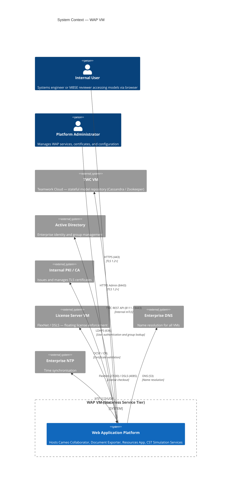
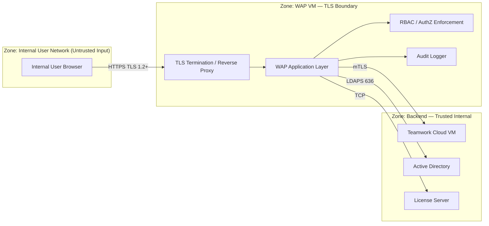
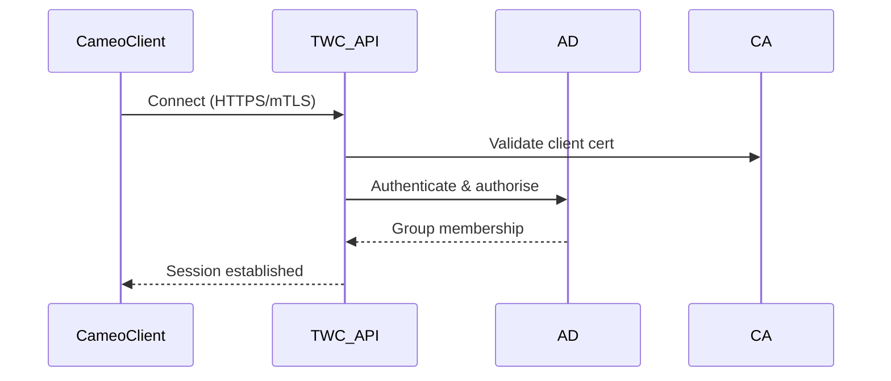
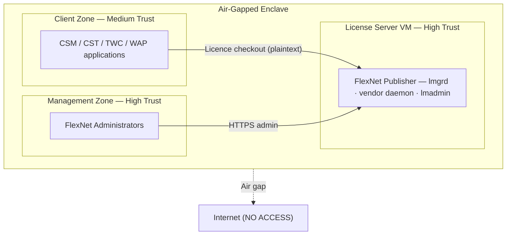
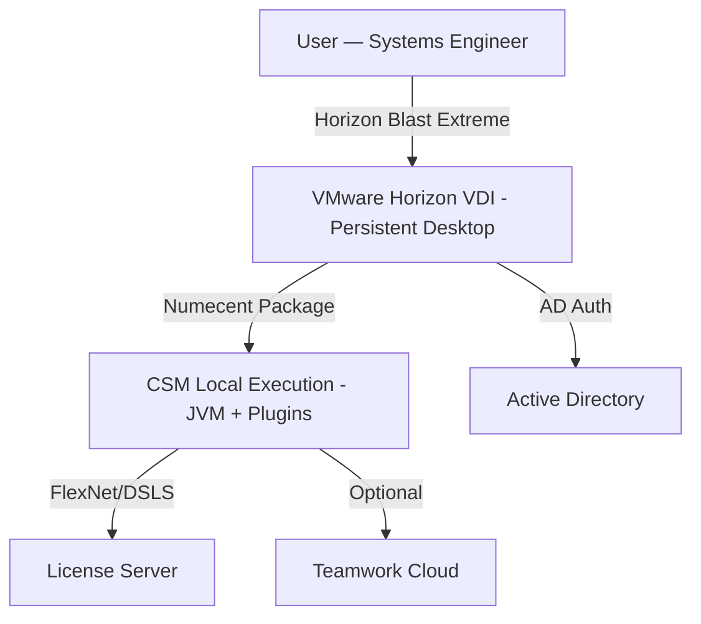
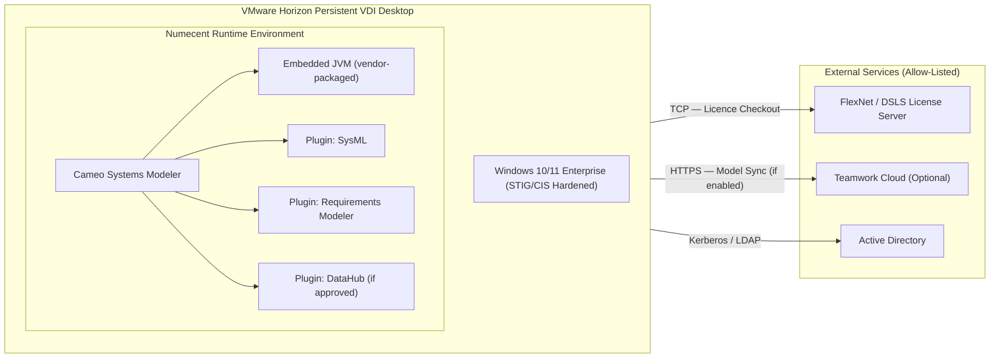

# Phoenix CAMEO — RBAC Reference

> **Programme:** Phoenix CAMEO MBSE
> **Document Type:** RBAC Reference — Unified System View
> **Generated:** 2026-04-09
> **Components Covered:** WAP · TWC · FlexNet · CST · CSM
> **Classification:** OFFICIAL — SENSITIVE | **Author:** Iain Reid
---

## Contents

- [1. System Overview](#1-system-overview)
- [2. WAP — Web Application Platform](#2-wap--web-application-platform)
- [3. TWC — Teamwork Cloud](#3-twc--teamwork-cloud)
- [4. FlexNet — License Server](#4-flexnet--license-server)
- [5. CST — Cameo Simulation Toolkit](#5-cst--cameo-simulation-toolkit)
- [6. CSM — Cameo Systems Modeler](#6-csm--cameo-systems-modeler)
- [7. Cross-Component RBAC Summary](#7-cross-component-rbac-summary)

---

## 1. System Overview

The Phoenix CAMEO MBSE toolchain enforces role-based access control (RBAC) at every tier. All identities are managed through Active Directory (AD); roles are assigned via AD group membership and enforced at the application layer of each component. There are no local application accounts. All privileged actions are logged to a SIEM.

### System Context

The diagram below shows the users, administrators, and external systems that interact with the platform. Roles defined in the sections that follow are mapped to the `Internal User` and `Platform Administrator` personas shown here.



---

## 2. WAP — Web Application Platform

> **Source:** `wap/docs/08_rbac_definition.md` | **Status:** Draft 0.2 | **Doc Ref:** WAP-DOC-08
### Role Definitions (WAP)

| Role ID | Role Name | Description | AD Group (TBC) | Privilege Level |
|---|---|---|---|---|
| WAP-R01 | Platform Administrator | Full administrative access to WAP configuration, services, and audit logs | `SG-WAP-Admins` | Highest |
| WAP-R02 | Collaborator User | Read/write access to Cameo Collaborator — view, comment, annotate models | `SG-WAP-CollabUsers` | Standard |
| WAP-R03 | Collaborator Viewer | Read-only access to Cameo Collaborator | `SG-WAP-CollabViewers` | Read-only |
| WAP-R04 | Document Export User | Collaborator Viewer access + submit document export jobs | `SG-WAP-DocExport` | Functional |
| WAP-R05 | Simulation User | Collaborator Viewer access + submit and monitor CST simulation jobs | `SG-WAP-SimUsers` | Functional |
| WAP-R06 | API Consumer | Programmatic service account access to WAP REST API | `SG-WAP-API` | Service |

---

### Access Control Matrix (WAP)

✅ = Permitted | ❌ = Denied | 🔍 = Permitted with audit log entry

| Capability | R01 Admin | R02 Collab User | R03 Viewer | R04 Doc Export | R05 Sim User | R06 API |
|---|---|---|---|---|---|---|
| Login to web interface | ✅ | ✅ | ✅ | ✅ | ✅ | ❌ |
| API token authentication | ✅ | ❌ | ❌ | ❌ | ❌ | ✅ |
| List accessible projects | ✅ | ✅ | ✅ | ✅ | ✅ | ✅ |
| Browse model elements and diagrams | ✅ | ✅ | ✅ | ✅ | ✅ | ✅ |
| Add comments / annotations | ✅ | ✅ | ❌ | ❌ | ❌ | ❌ |
| Submit document export job | ✅ 🔍 | ✅ | ❌ | ✅ 🔍 | ❌ | ✅ 🔍 |
| Download own export result | ✅ | ✅ | ❌ | ✅ | ❌ | ✅ |
| View all users' export jobs | ✅ 🔍 | ❌ | ❌ | ❌ | ❌ | ❌ |
| Submit simulation job | ✅ 🔍 | ❌ | ❌ | ❌ | ✅ 🔍 | ✅ 🔍 |
| View own simulation job status | ✅ | ❌ | ❌ | ❌ | ✅ | ✅ |
| Cancel any simulation job | ✅ 🔍 | ❌ | ❌ | ❌ | ❌ | ❌ |
| Access admin console | ✅ 🔍 | ❌ | ❌ | ❌ | ❌ | ❌ |
| Manage service configuration | ✅ 🔍 | ❌ | ❌ | ❌ | ❌ | ❌ |
| View audit logs | ✅ 🔍 | ❌ | ❌ | ❌ | ❌ | ❌ |

---

### Service Account Definitions (WAP)

| Account ID | Account Name | Purpose | Permissions | Rotation |
|---|---|---|---|---|
| WAP-SA-01 | `svc-wap-twc` | WAP → TWC REST API integration | Read access to all TWC projects | Quarterly |
| WAP-SA-02 | `svc-wap-bind` | LDAP bind account for AD authentication | Read-only AD bind — no write | Quarterly |

---

### Trust Boundaries & RBAC Enforcement (WAP)

The diagram below shows where RBAC / AuthZ enforcement sits within the WAP processing pipeline. All inbound requests from the internal user network pass through TLS termination before reaching the WAP Application Layer. The RBAC/AuthZ Enforcement node validates the caller's role (resolved from AD group membership) before any capability is exercised. All admin and user actions are forwarded to the Audit Logger.



---

## 3. TWC — Teamwork Cloud

> **Source:** `twc/docs/08_rbac_definition_access_matrix.md` | **Status:** Not Started 0.1-DRAFT | **Doc Ref:** DOC-08
> ⚠️ **Status:** This section is Not Started. AD group names require confirmation.
### Role Definitions (TWC)

| Role | Description | AD Group (Placeholder) |
|------|-------------|----------------------|
| TWC-Admin | Full administrative access to TWC | `<AD_GRP_TWC_ADMIN>` |
| TWC-ProjectAdmin | Create/manage projects, manage members | `<AD_GRP_TWC_PROJADMIN>` |
| TWC-Modeller | Read/write access to assigned projects | `<AD_GRP_TWC_MODELLER>` |
| TWC-Reviewer | Read-only access to assigned projects | `<AD_GRP_TWC_REVIEWER>` |
| TWC-AuditViewer | Access to audit logs only | `<AD_GRP_TWC_AUDIT>` |

---

### Permission Matrix (TWC)

| Permission | TWC-Admin | TWC-ProjectAdmin | TWC-Modeller | TWC-Reviewer | TWC-AuditViewer |
|-----------|:---------:|:----------------:|:------------:|:------------:|:---------------:|
| Create project | ✓ | ✓ | ✗ | ✗ | ✗ |
| Delete project | ✓ | ✗ | ✗ | ✗ | ✗ |
| Add project member | ✓ | ✓ | ✗ | ✗ | ✗ |
| Commit changes | ✓ | ✓ | ✓ | ✗ | ✗ |
| Read project | ✓ | ✓ | ✓ | ✓ | ✗ |
| View audit logs | ✓ | ✗ | ✗ | ✗ | ✓ |
| Manage users | ✓ | ✗ | ✗ | ✗ | ✗ |
| Server configuration | ✓ | ✗ | ✗ | ✗ | ✗ |

---

### TWC Authentication & Authorisation Flow

The sequence below shows how a Cameo client establishes a session with the TWC API. AD group membership is checked at connection time to resolve the caller's TWC role; subsequent authorisation decisions (e.g. project read/write) are made against that resolved role.



---

## 4. FlexNet — License Server

> **Source:** `flexnet/docs/08_rbac_definition.md` | **Status:** ✅ Complete | **Version:** 0.2.0
### Roles Summary (FlexNet)

| Role ID | Role Name | Scope | AD Group |
|---------|-----------|-------|---------|
| FNA | FlexNet Administrator | Full lmadmin access; service management via OS sudo | `<AD_GROUP_FLEXNET_ADMIN>` |
| FNO | FlexNet Operator | Read-only lmadmin; log access; no service control | `<AD_GROUP_FLEXNET_OPERATOR>` |
| FNT | FlexNet Auditor | Audit log read access only | `<AD_GROUP_FLEXNET_AUDITOR>` |
| OSA | OS Administrator | RHEL 9 OS management via sudo | `<AD_GROUP_OS_ADMIN>` |
| SVC | Service Account | Non-interactive; runs `flexnet.service` only | `svc_flexnet` (local system) |

---

### Privilege Matrix (FlexNet)

| Action | FNA | FNO | FNT | OSA | SVC |
|--------|:---:|:---:|:---:|:---:|:---:|
| View licence checkout status (lmstat) | ✅ | ✅ | ❌ | ✅ | N/A |
| View audit logs | ✅ | ✅ | ✅ | ✅ | N/A |
| Start / stop / restart flexnet.service | ✅ | ❌ | ❌ | ✅ | N/A |
| Force licence reload (lmreread) | ✅ | ❌ | ❌ | ❌ | N/A |
| Remove stuck checkout (lmremove) | ✅ | ❌ | ❌ | ❌ | N/A |
| Deploy / replace licence file | ✅ | ❌ | ❌ | ❌ | N/A |
| lmadmin web console — full admin | ✅ | ❌ | ❌ | ❌ | N/A |
| lmadmin web console — read-only | ✅ | ✅ | ❌ | ❌ | N/A |
| OS sudo (full) | ❌ | ❌ | ❌ | ✅ | N/A |
| Apply OS patches | ❌ | ❌ | ❌ | ✅ | N/A |
| Run `flexnet.service` process | ❌ | ❌ | ❌ | ❌ | ✅ |
| Interactive OS login | ❌ | ❌ | ❌ | ✅ | ❌ |

---

### Filesystem ACLs (FlexNet)

```bash
# FlexNet installation directory
sudo chown -R root:svc_flexnet /opt/flexnet && sudo chmod -R 750 /opt/flexnet

# Licence file — readable by service account; not world-readable
sudo chown root:svc_flexnet /etc/flexnet/license.lic && sudo chmod 640 /etc/flexnet/license.lic

# TLS private key — root-only read
sudo chown root:root /etc/flexnet/tls/server.key && sudo chmod 400 /etc/flexnet/tls/server.key

# Log directory
sudo chown -R svc_flexnet:svc_flexnet /var/log/flexnet && sudo chmod -R 750 /var/log/flexnet
```

---

### Trust Boundaries (FlexNet)

The diagram below shows the two access zones that interact with the licence server. Client applications (CSM, CST, TWC, WAP) perform licence checkouts from the Client Zone. Only personnel in the Management Zone (FlexNet Administrators / OS Administrators) have privileged access. There is no internet connectivity.



---

## 5. CST — Cameo Simulation Toolkit

> **Source:** `cst/docs/08_rbac_definition.md` | **Status:** In Progress 0.2-DRAFT | **Doc Ref:** DOC-08
### Role Definitions (CST)

| Role | Description | Assigned Persona | Granted By |
|------|-------------|-----------------|-----------|
| `CST_USER` | Run simulations locally within CSM; view and export own results | Systems Engineers | MBSE Tool Administrator |
| `CST_SIMULATION_SPECIALIST` | Run advanced simulations; delegate to server-side; configure model execution parameters | Simulation Specialists | MBSE Tool Administrator |
| `CST_ADMIN` | Install and update CST plugin; configure JVM and licence settings; view audit logs | MBSE Tool Administrators | Platform Operations |
| `CST_PLATFORM_OPS` | Manage server-side CST service on Windows Server 2025; apply OS hardening; manage AD groups | Platform Operations | Programme Security Authority |
| `CST_READONLY` | View simulation results only; no simulation execution rights | Reviewers / Auditors | MBSE Tool Administrator |

---

### Permission Matrix (CST)

| Permission | CST_USER | CST_SIMULATION_SPECIALIST | CST_ADMIN | CST_PLATFORM_OPS | CST_READONLY |
|------------|:--------:|:------------------------:|:---------:|:---------------:|:------------:|
| Run local simulation (CSM client) | ✅ | ✅ | ✅ | ❌ | ❌ |
| Run server-side simulation (via WAP) | ❌ | ✅ | ✅ | ❌ | ❌ |
| View own simulation results | ✅ | ✅ | ✅ | ❌ | ❌ |
| View all simulation results | ❌ | ❌ | ✅ | ✅ | ✅ |
| Export own results (CSV/XML/PDF) | ✅ | ✅ | ✅ | ❌ | ✅ |
| Delete simulation results | ❌ | ❌ | ✅ | ❌ | ❌ |
| Configure JVM settings (client) | ❌ | ❌ | ✅ | ❌ | ❌ |
| Configure JVM settings (server) | ❌ | ❌ | ❌ | ✅ | ❌ |
| Install / update CST plugin (client) | ❌ | ❌ | ✅ | ❌ | ❌ |
| Deploy / restart CST server service | ❌ | ❌ | ❌ | ✅ | ❌ |
| View Windows Event Log (simulation) | ❌ | ❌ | ✅ | ✅ | ❌ |
| Manage AD group membership | ❌ | ❌ | ❌ | ✅ | ❌ |

---

### Server-Side Simulation — AD Role Validation Flow (CST)

The sequence below shows how WAP enforces the CST RBAC roles for server-side simulation. When the AD role check fails, WAP returns `403 Forbidden` before any simulation resource is allocated. This is the primary access enforcement boundary for server-side CST execution.

```mermaid
sequenceDiagram
    autonumber
    actor SE as Systems Engineer
    participant CSM as CSM Client (Windows 10/11)
    participant WAP as Web Application Platform (Windows Server 2025)
    participant CST_S as CST Server Service (JVM)
    participant LIC as FlexNet Licence Server
    participant AD as Active Directory
    SE->>CSM: Select model; choose "Run Simulation (server-side)"
    CSM->>WAP: HTTPS POST /simulate (TLS 1.2+, Kerberos token)
    WAP->>AD: Validate Kerberos token; check group membership
    alt Auth fails or insufficient role
        AD-->>WAP: Denied
        WAP-->>CSM: 403 Forbidden
    end
    AD-->>WAP: Auth OK; roles confirmed
    WAP->>CST_S: Route simulation request
    CST_S->>LIC: Request server-side licence checkout
    LIC-->>CST_S: Licence granted
    CST_S->>CST_S: Execute simulation
    CST_S->>LIC: Return licence
    CST_S-->>WAP: Return result reference
    WAP-->>CSM: HTTPS 200 + result reference
    CSM-->>SE: Display simulation results
```

---

## 6. CSM — Cameo Systems Modeler

> **Source:** `csm/docs/08_rbac_definition.md` | **Status:** ✅ Done
### Role Definitions (CSM)

| Role ID | Role Name | Description |
|---|---|---|
| R01 | Systems Engineer | Primary SysML modelling user |
| R02 | Lead Architect | Senior modeller; model review and approval |
| R03 | MBSE Tool Administrator | Manages CSM package, plugins, JVM config |
| R04 | VDI Platform Engineer | Manages Horizon pool, OS image, profiles |
| R05 | Cybersecurity Compliance Officer | Reviews compliance posture; approves exceptions |

---

### Access Matrix (CSM)

**VDI Access:**

| Permission | R01 | R02 | R03 | R04 | R05 |
|---|---|---|---|---|---|
| Connect to Horizon VDI | ✅ | ✅ | ✅ | ✅ | 🔍 Audit only |
| Local Administrator on VDI | ❌ | ❌ | ⚠️ Break-glass only | ✅ | ❌ |
| Reset VDI pool desktop | ❌ | ❌ | ❌ | ✅ | ❌ |

**CSM Application:**

| Permission | R01 | R02 | R03 | R04 | R05 |
|---|---|---|---|---|---|
| Launch CSM | ✅ | ✅ | ✅ | ❌ | ❌ |
| Create / edit SysML models | ✅ | ✅ | ❌ | ❌ | ❌ |
| Approve / baseline models | ❌ | ✅ | ❌ | ❌ | ❌ |
| Install / update plugins | ❌ | ❌ | ✅ | ❌ | ❌ |
| Modify JVM configuration | ❌ | ❌ | ✅ | ❌ | ❌ |

**Licence Server:**

| Permission | R01 | R02 | R03 | R04 | R05 |
|---|---|---|---|---|---|
| Consume floating licence | ✅ | ✅ | ✅ | ❌ | ❌ |
| View licence usage | ❌ | ❌ | ✅ | ❌ | ✅ |
| Administer licence server | ❌ | ❌ | ✅ | ❌ | ❌ |

---

### AD Group Mapping (CSM)

| Role | AD Group | Notes |
|---|---|---|
| R01 — Systems Engineer | `<AD_GROUP_SE>` | Grants Horizon pool entitlement; FlexNet licence seat |
| R02 — Lead Architect | `<AD_GROUP_LA>` | Grants Horizon pool entitlement; FlexNet licence seat; TWC project create rights |
| R03 — MBSE Tool Admin | `<AD_GROUP_ADMIN>` | Grants Horizon admin console access; Numecent admin access |
| R04 — VDI Platform Engineer | `<AD_GROUP_VDI>` | Grants Horizon infrastructure admin rights |
| R05 — Compliance Officer | `<AD_GROUP_COMPLIANCE>` | Read-only audit access |

---

### CSM Deployment Model

The diagram below shows the runtime topology of the CSM deployment. All user identity flows through Active Directory (Kerberos); the licence server connection and optional TWC connection are the only outbound network paths allowed from the VDI.



---

### CSM Logical Component — External Auth Connections

The diagram below shows the logical components of the CSM deployment and how the VDI desktop connects to external services. Active Directory is the identity authority for all authentication; there is no direct internet access.



---

## 7. Cross-Component RBAC Summary

### AD Group Index (All Components)

| AD Group | Component | Role | Privilege Level |
|---|---|---|---|
| `SG-WAP-Admins` | WAP | Platform Administrator (WAP-R01) | Highest |
| `SG-WAP-CollabUsers` | WAP | Collaborator User (WAP-R02) | Standard |
| `SG-WAP-CollabViewers` | WAP | Collaborator Viewer (WAP-R03) | Read-only |
| `SG-WAP-DocExport` | WAP | Document Export User (WAP-R04) | Functional |
| `SG-WAP-SimUsers` | WAP | Simulation User (WAP-R05) | Functional |
| `SG-WAP-API` | WAP | API Consumer (WAP-R06) | Service |
| `<AD_GRP_TWC_ADMIN>` | TWC | TWC-Admin | Full admin |
| `<AD_GRP_TWC_PROJADMIN>` | TWC | TWC-ProjectAdmin | Project admin |
| `<AD_GRP_TWC_MODELLER>` | TWC | TWC-Modeller | Read/write |
| `<AD_GRP_TWC_REVIEWER>` | TWC | TWC-Reviewer | Read-only |
| `<AD_GRP_TWC_AUDIT>` | TWC | TWC-AuditViewer | Audit only |
| `<AD_GROUP_FLEXNET_ADMIN>` | FlexNet | FlexNet Administrator (FNA) | Full lmadmin |
| `<AD_GROUP_FLEXNET_OPERATOR>` | FlexNet | FlexNet Operator (FNO) | Read-only lmadmin |
| `<AD_GROUP_FLEXNET_AUDITOR>` | FlexNet | FlexNet Auditor (FNT) | Audit logs only |
| `<AD_GROUP_OS_ADMIN>` | FlexNet | OS Administrator (OSA) | OS sudo |
| `<AD_GROUP_SE>` | CSM | Systems Engineer (R01) | Model authoring |
| `<AD_GROUP_LA>` | CSM | Lead Architect (R02) | Model approval; TWC project create |
| `<AD_GROUP_ADMIN>` | CSM | MBSE Tool Administrator (R03) | Tool admin |
| `<AD_GROUP_VDI>` | CSM | VDI Platform Engineer (R04) | VDI infra admin |
| `<AD_GROUP_COMPLIANCE>` | CSM | Compliance Officer (R05) | Audit read-only |

---

### Persona-to-Role Mapping (Cross-Component)

| Persona | WAP Role | TWC Role | FlexNet | CST Role | CSM Role |
|---|---|---|---|---|---|
| Systems Engineer | WAP-R02 Collab User | TWC-Modeller | Seat consumer (via `<AD_GROUP_SE>`) | `CST_USER` | R01 Systems Engineer |
| Lead Architect / Senior Modeller | WAP-R02 Collab User | TWC-ProjectAdmin | Seat consumer (via `<AD_GROUP_LA>`) | `CST_USER` | R02 Lead Architect |
| MBSE Tool Administrator | WAP-R01 Platform Admin | TWC-Admin | FNA FlexNet Admin (via `<AD_GROUP_ADMIN>`) | `CST_ADMIN` | R03 MBSE Tool Admin |
| Simulation Specialist | WAP-R05 Simulation User | TWC-Modeller | Seat consumer | `CST_SIMULATION_SPECIALIST` | R01 Systems Engineer |
| VDI Platform Engineer | — | — | OSA OS Admin (via `<AD_GROUP_VDI>`) | `CST_PLATFORM_OPS` | R04 VDI Platform Engineer |
| Cybersecurity Compliance Officer | WAP-R03 Viewer | TWC-AuditViewer | FNT Auditor | `CST_READONLY` | R05 Compliance Officer |
| Reviewer / Auditor | WAP-R03 Viewer | TWC-Reviewer | — | `CST_READONLY` | — |
| API / Service Account | WAP-R06 API Consumer | — | — | — | — |
| FlexNet Operator | — | — | FNO FlexNet Operator | — | — |

---

### Service Accounts (All Components)

| Account | Component | Purpose | Rotation |
|---|---|---|---|
| `svc-wap-twc` | WAP | WAP → TWC REST API integration | Quarterly |
| `svc-wap-bind` | WAP | LDAP bind account for AD authentication | Quarterly |
| `svc_flexnet` | FlexNet | Runs `flexnet.service`; non-interactive | N/A (local system account) |

---

*Generated: 2026-04-09 | Classification: OFFICIAL — SENSITIVE | Author: Iain Reid*
