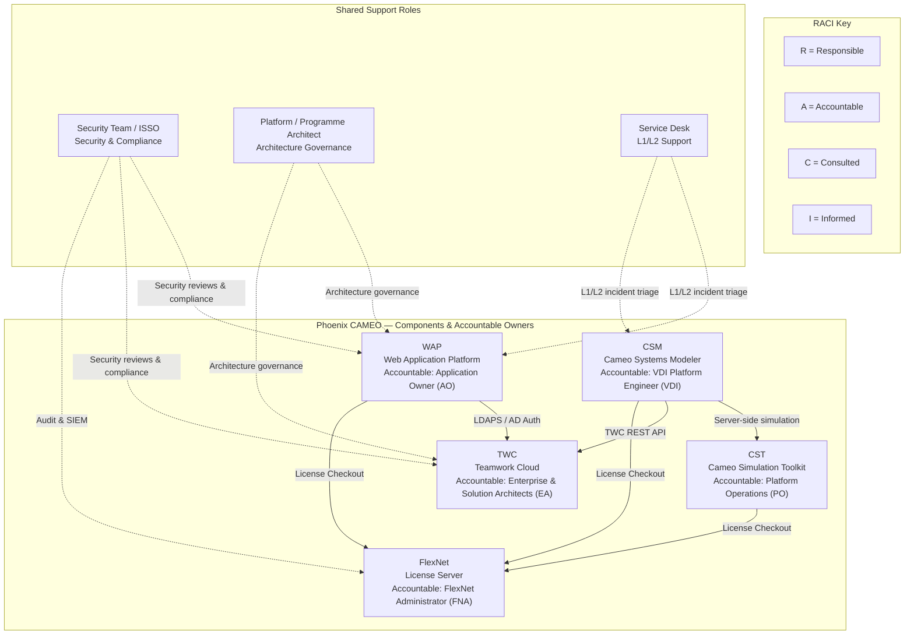
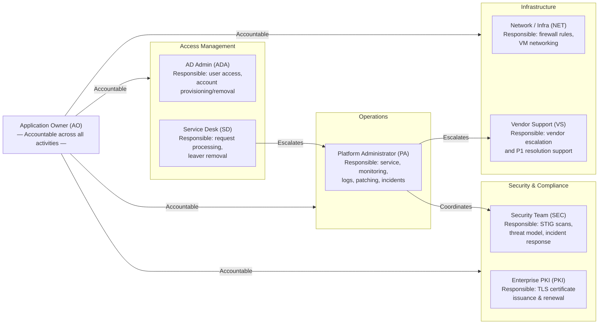
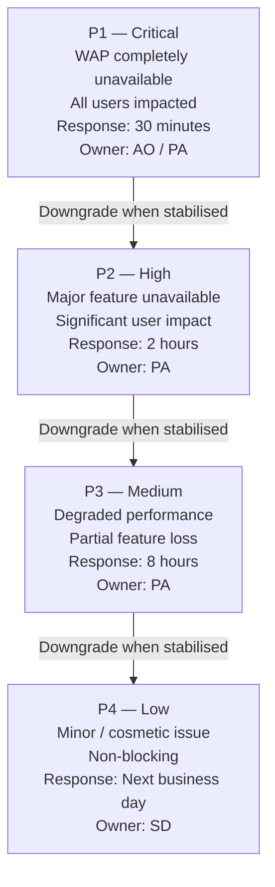
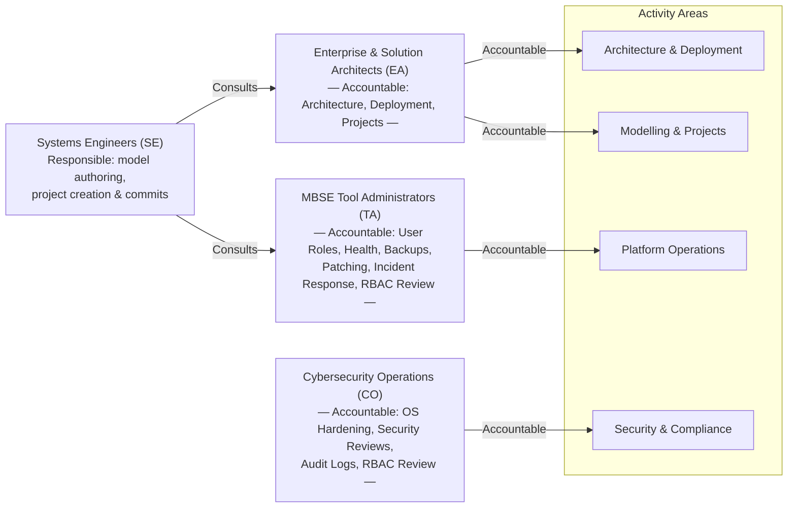
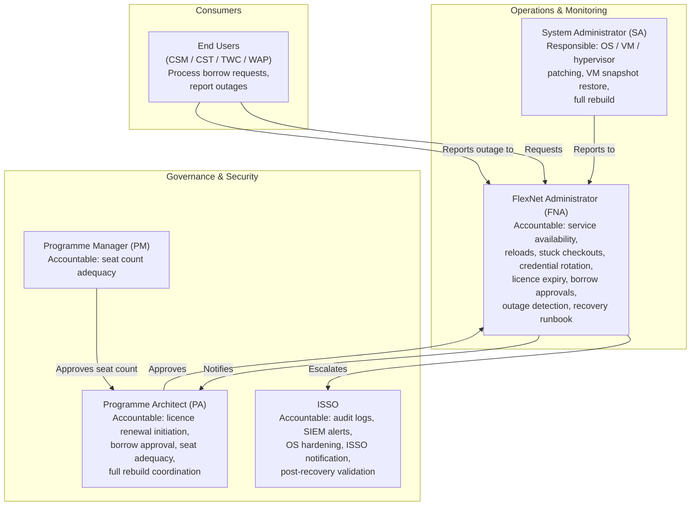
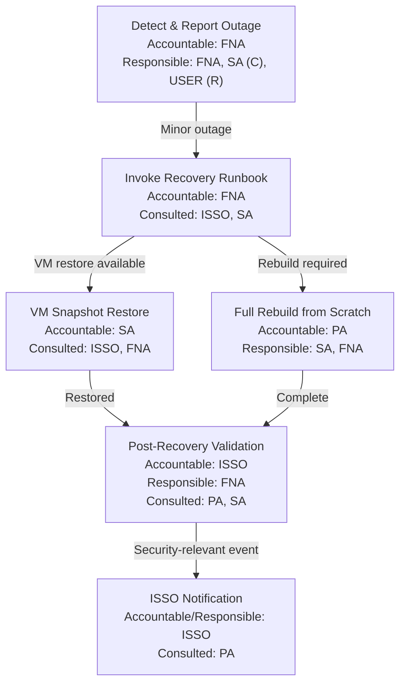
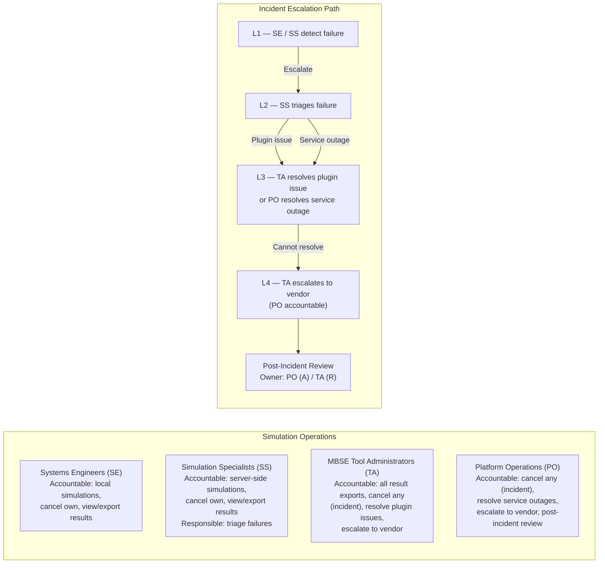
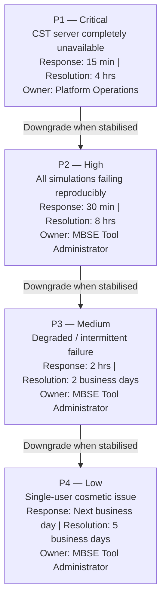
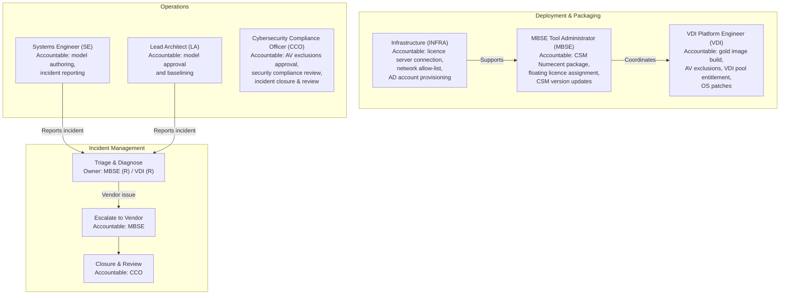

# Phoenix CAMEO — RACI Matrix

> **Programme:** Phoenix CAMEO MBSE
> **Document Type:** RACI Matrix
> **Classification:** OFFICIAL — SENSITIVE
> **Generated:** 2026-04-08
> **Author:** Iain Reid
> **Components Covered:** WAP · TWC · FlexNet · CST · CSM
---

**RACI Key:** R = Responsible | A = Accountable | C = Consulted | I = Informed

---

## Contents

1. [System Overview](#1-system-overview)
2. [WAP — Web Application Platform](#2-wap--web-application-platform)
   - [2.1 Stakeholders](#21-stakeholders)
   - [2.2 Accountability Map](#22-accountability-map)
   - [2.3 RACI Matrix](#23-raci-matrix)
   - [2.4 Incident Severity](#24-incident-severity)
3. [TWC — Teamwork Cloud](#3-twc--teamwork-cloud)
   - [3.1 Personas](#31-personas)
   - [3.2 Accountability Map](#32-accountability-map)
   - [3.3 RACI Table](#33-raci-table)
4. [FlexNet — License Server](#4-flexnet--license-server)
   - [4.1 Roles](#41-roles)
   - [4.2 Accountability Map](#42-accountability-map)
   - [4.3 RACI Table — Operations](#43-raci-table--operations)
   - [4.4 RACI Table — Licence Management](#44-raci-table--licence-management)
   - [4.5 RACI Table — Recovery](#45-raci-table--recovery)
5. [CST — Cameo Simulation Toolkit](#5-cst--cameo-simulation-toolkit)
   - [5.1 Persona Key](#51-persona-key)
   - [5.2 Accountability Map](#52-accountability-map)
   - [5.3 RACI Table — Simulation Operations](#53-raci-table--simulation-operations)
   - [5.4 RACI Table — Incident Response](#54-raci-table--incident-response)
   - [5.5 SLA Targets](#55-sla-targets)
6. [CSM — Cameo Systems Modeler](#6-csm--cameo-systems-modeler)
   - [6.1 Roles](#61-roles)
   - [6.2 Accountability Map](#62-accountability-map)
   - [6.3 RACI Table](#63-raci-table)

---

## 1. System Overview

The Phoenix CAMEO deployment is a five-component MBSE toolchain. The diagram below shows the primary accountable owner for each component and the key cross-component support flows.

| Component | Primary Accountable Role | Key Responsible Role | Security Oversight |
|-----------|--------------------------|----------------------|--------------------|
| WAP | Application Owner (AO) | Platform Administrator (PA) | Security Team (SEC) |
| TWC | Enterprise & Solution Architects (EA) | MBSE Tool Administrator (TA) | Cybersecurity Operations (CO) |
| FlexNet | FlexNet Administrator (FNA) | FlexNet Administrator (FNA) | ISSO |
| CST | Platform Operations (PO) | MBSE Tool Administrator (TA) | Platform Operations (PO) |
| CSM | VDI Platform Engineer (VDI) | VDI Platform Engineer (VDI) | Cybersecurity Compliance Officer (CCO) |

---

## 2. WAP — Web Application Platform

> **Source:** `wap/docs/09_raci_matrix.md` | **Status:** Draft 0.2 | **Doc Ref:** WAP-DOC-09
### 2.1 Stakeholders

| Role | Description |
|---|---|
| Platform Administrator (PA) | Technical operator of WAP VM |
| Application Owner (AO) | Business / functional owner of WAP capability |
| Security Team (SEC) | Information security and compliance |
| Network / Infrastructure (NET) | Networking, VMware, firewall |
| Active Directory Admin (ADA) | AD group management and service accounts |
| DXC Service Desk (SD) | Level 1/2 support and request handling |
| End Users (EU) | Systems engineers and reviewers |
| Vendor Support (VS) | No Magic / Dassault Systèmes support |
| Enterprise PKI Team (PKI) | Internal CA certificate issuance |

---

### 2.2 Accountability Map

---

### 2.3 RACI Matrix

| Activity | PA | AO | SEC | NET | ADA | SD | EU | VS | PKI |
|---|---|---|---|---|---|---|---|---|---|
| **Deployment & Infrastructure** |||||||||
| Initial WAP VM provisioning and OS deployment | R | A | C | C | I | I | I | I | I |
| OS hardening (CIS L2 / DISA STIG) | R | A | C | I | I | I | I | C | I |
| WAP software installation and configuration | R | A | C | I | I | I | I | C | I |
| TLS certificate request and issuance | C | A | C | I | I | I | I | I | R |
| AD service account creation | C | A | I | I | R | I | I | I | I |
| Firewall rules (WAP port allowlist) | C | A | C | R | I | I | I | I | I |
| **Operations** |||||||||
| WAP service start / stop / restart | R | A | I | I | I | I | I | I | I |
| Health monitoring and alerting | R | A | C | I | I | I | I | I | I |
| Log review and SIEM integration | R | A | R | I | I | I | I | I | I |
| **Access Management** |||||||||
| User access request processing | I | A | I | I | R | R | I | I | I |
| Role assignment approval | A | A | C | I | I | C | I | I | I |
| Quarterly access review | R | A | R | I | C | I | I | I | I |
| Leaver account removal | I | A | I | I | R | R | I | I | I |
| **Maintenance & Patching** |||||||||
| OS patch review and application | R | A | C | I | I | I | I | I | I |
| WAP application update application | R | A | C | I | I | I | I | C | I |
| TLS certificate renewal (60-day threshold) | R | A | C | I | I | I | I | I | C |
| **Security & Compliance** |||||||||
| STIG compliance scan execution | R | A | R | I | I | I | I | I | I |
| Threat model review | C | A | R | I | I | I | I | I | I |
| Security incident response | R | A | R | C | C | R | I | C | I |
| **Incident Management** |||||||||
| P1 incident declaration | A | A | C | C | I | R | I | I | I |
| P1 incident resolution coordination | R | A | C | C | I | R | I | C | I |
| Vendor support engagement | R | A | I | I | I | I | I | R | I |
| Post-incident review | R | A | R | C | I | C | I | C | I |

---

### 2.4 Incident Severity

| Severity | Definition | Response Target |
|---|---|---|
| P1 — Critical | WAP completely unavailable; all users impacted | 30 minutes |
| P2 — High | Major feature unavailable; significant user impact | 2 hours |
| P3 — Medium | Degraded performance; partial feature loss | 8 hours |
| P4 — Low | Minor issue; cosmetic or non-blocking | Next business day |

---

## 3. TWC — Teamwork Cloud

> **Source:** `twc/docs/09_raci_matrix.md` | **Status:** Not Started 0.1-DRAFT | **Doc Ref:** DOC-09
### 3.1 Personas

| Code | Persona |
|------|---------|
| SE | Systems Engineers |
| TA | MBSE Tool Administrators |
| CO | Cybersecurity Operations |
| EA | Enterprise & Solution Architects |

---

### 3.2 Accountability Map

---

### 3.3 RACI Table

| Activity | SE | TA | CO | EA |
|----------|----|----|----|-----|
| Define architecture requirements | C | C | C | A/R |
| Deploy TWC VM | I | R | C | A |
| Harden OS baseline (STIG/CIS) | I | R | A | I |
| Configure AD integration | I | R | C | I |
| Manage TWC user roles | I | A/R | C | I |
| Create / manage projects | R | C | I | R |
| Commit model changes | R | I | I | R |
| Monitor service health | I | A/R | C | I |
| Perform backups | I | A/R | I | I |
| Apply OS patches | I | R | A | I |
| Conduct security reviews | I | C | A/R | C |
| Review audit logs | I | C | A/R | I |
| Incident response | I | R | A | I |
| Quarterly RBAC access review | I | R | A | C |

---

## 4. FlexNet — License Server

> **Source:** `flexnet/docs/09_raci_matrix.md` | **Status:** ✅ Complete | **Version:** 0.2.0
### 4.1 Roles

| Role ID | Role | Representative |
|---------|------|----------------|
| PA | Phoenix Programme Architect | `<PA_NAME>` |
| ISSO | Information Systems Security Officer | `<ISSO_NAME>` |
| SA | System Administrator (OS / VM / Hypervisor) | `<SA_NAME>` |
| FNA | FlexNet Administrator | `<FNA_NAME>` |
| PM | Programme Manager | `<PM_NAME>` |
| USER | End User (CSM / CST / TWC / WAP) | All tool users |

---

### 4.2 Accountability Map

---

### 4.3 RACI Table — Operations

| Activity | PA | ISSO | SA | FNA | PM | USER |
|----------|:--:|:----:|:--:|:---:|:--:|:----:|
| Monitor service availability | I | I | C | A/R | I | I |
| Restart service on failure | I | I | C | A/R | I | I |
| Force reload licence file (lmreread) | I | I | I | A/R | I | I |
| Remove stuck checkout (lmremove) | I | I | I | A/R | I | C |
| Rotate lmadmin credentials | I | A | I | R | I | I |
| Review audit logs (weekly) | I | A/R | C | C | I | I |
| Respond to SIEM alerts | I | A | C | R | I | I |

---

### 4.4 RACI Table — Licence Management

| Activity | PA | ISSO | SA | FNA | PM | USER |
|----------|:--:|:----:|:--:|:---:|:--:|:----:|
| Monitor licence expiry dates | I | I | I | A/R | I | I |
| Initiate licence renewal request | A | I | I | R | C | I |
| Approve offline licence borrow | A | C | I | R | I | C |
| Process borrow request (lmborrow) | I | I | I | A/R | I | R |
| Manage seat count adequacy | A | I | I | C | R | I |

---

### 4.5 RACI Table — Recovery

| Activity | PA | ISSO | SA | FNA | PM | USER |
|----------|:--:|:----:|:--:|:---:|:--:|:----:|
| Detect and report outage | I | I | C | A/R | I | R |
| Invoke recovery runbook (doc 05) | I | C | C | A/R | I | I |
| VM snapshot restore | I | C | A/R | C | I | I |
| Full rebuild from scratch | A | C | R | R | I | I |
| Post-recovery validation | C | A | C | R | I | I |
| ISSO notification (security relevant) | C | A/R | I | I | I | I |

---

## 5. CST — Cameo Simulation Toolkit

> **Source:** `cst/docs/09_raci_matrix.md` | **Status:** In Progress 0.2-DRAFT | **Doc Ref:** DOC-09
### 5.1 Persona Key

| Code | Persona | AD Role |
|------|---------|---------|
| SE | Systems Engineers | `CST_USER` |
| SS | Simulation Specialists | `CST_SIMULATION_SPECIALIST` |
| TA | MBSE Tool Administrators | `CST_ADMIN` |
| PO | Platform Operations | `CST_PLATFORM_OPS` |

---

### 5.2 Accountability Map

---

### 5.3 RACI Table — Simulation Operations

| Activity | SE | SS | TA | PO |
|----------|----|----|----|-----|
| Run local simulation | R/A | C | I | I |
| Run server-side simulation | R | A | C | I |
| Cancel simulation (own) | R/A | R/A | I | I |
| Cancel simulation (any — incident) | I | I | R | A |
| View simulation results | R | R | A | I |
| Export simulation results | R | R | A | I |

---

### 5.4 RACI Table — Incident Response

| Activity | SE | SS | TA | PO |
|----------|----|----|----|-----|
| Detect simulation failure (own) | R | R | I | I |
| Triage simulation failure | C | R | C | I |
| Resolve plugin issue | I | C | R/A | I |
| Resolve server-side service outage | I | I | C | R/A |
| Escalate to vendor support | I | I | R | A |
| Post-incident review | C | C | R | A |

---

### 5.5 SLA Targets

| Severity | Description | Response Time | Resolution Target | Owner |
|----------|-------------|--------------|------------------|-------|
| P1 — Critical | CST server service completely unavailable | 15 minutes | 4 hours | Platform Operations |
| P2 — High | All simulations failing reproducibly | 30 minutes | 8 hours | MBSE Tool Administrator |
| P3 — Medium | Degraded performance; intermittent failure | 2 hours | 2 business days | MBSE Tool Administrator |
| P4 — Low | Single-user cosmetic issue | Next business day | 5 business days | MBSE Tool Administrator |

---

## 6. CSM — Cameo Systems Modeler

> **Source:** `csm/docs/09_raci_matrix.md` | **Status:** ✅ Done
### 6.1 Roles

| Code | Role |
|---|---|
| SE | Systems Engineer |
| LA | Lead Architect |
| MBSE | MBSE Tool Administrator |
| VDI | VDI Platform Engineer |
| CCO | Cybersecurity Compliance Officer |
| INFRA | Infrastructure (Licence Server / Network) |

---

### 6.2 Accountability Map

---

### 6.3 RACI Table

| Activity | SE | LA | MBSE | VDI | CCO | INFRA |
|---|---|---|---|---|---|---|
| **Deployment & Packaging** |||||||
| Build VDI gold image | I | I | C | R/A | C | I |
| Package CSM in Numecent | I | I | R/A | I | C | I |
| Configure licence server connection | I | I | C | I | I | R/A |
| Configure network allow-list | I | I | C | C | C | R/A |
| Configure AV exclusions | I | I | C | R | A | I |
| **User Onboarding** |||||||
| Provision AD account | I | I | C | I | I | R/A |
| Assign VDI pool entitlement | I | I | C | R/A | I | I |
| Assign floating licence | I | I | R/A | I | I | C |
| **Operations** |||||||
| Author SysML models | R | R | I | I | I | I |
| Approve / baseline models | C | R/A | I | I | I | I |
| Monitor licence utilisation | I | I | R | I | A | C |
| Monitor VDI health | I | I | I | R/A | I | I |
| Apply OS patches | I | I | C | R/A | C | I |
| Update CSM package version | I | I | R/A | C | C | I |
| Review security compliance | I | I | C | C | R/A | I |
| **Incident Management** |||||||
| Report incident | R | R | I | I | I | I |
| Triage and diagnose | I | I | R | R | C | C |
| Escalate to vendor | I | I | R/A | C | I | I |
| Incident closure and review | I | I | C | C | R/A | I |

---

*Generated: 2026-04-08 | Classification: OFFICIAL — SENSITIVE | Author: Iain Reid*
